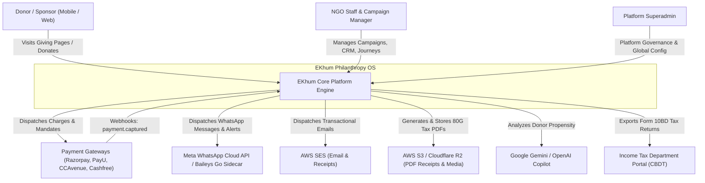
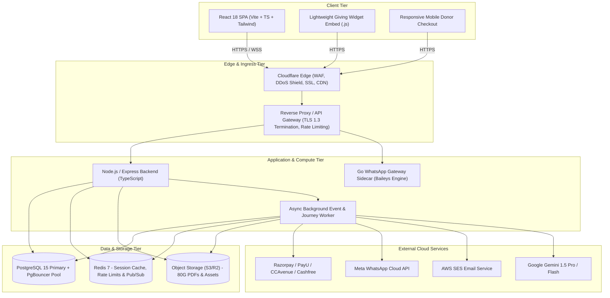
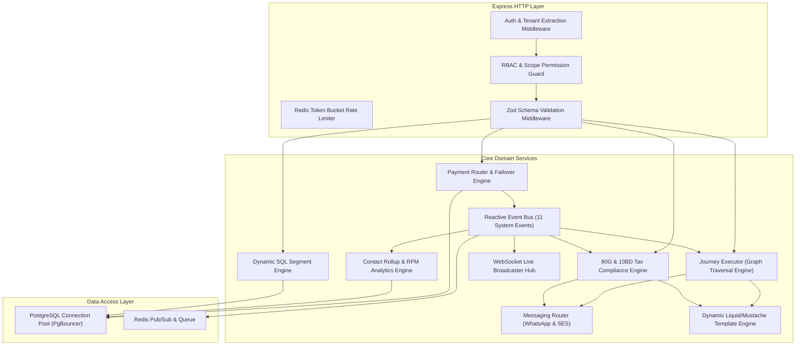

# EKhum (DanaPro / Philanthropy OS) — Complete Software Architecture Design

---

## 1. Architectural Vision & Core Principles

EKhum is an enterprise-grade **Philanthropy & Individual Giving Operating System** built to handle high-velocity fundraising campaigns, automated donor lifecycle journeys, multi-gateway fintech transactions, and strict Indian statutory compliance (Section 80G and Form 10BD).

### Architectural Tenets
1. **High Concurrency & Low Latency**: Checkout pages and API endpoints must maintain sub-100ms response times even during viral campaign spikes.
2. **Zero-Loss Financial Event Architecture**: Every payment state transition is captured idempotently with cryptographic auditability and dead-letter queue resilience.
3. **Parametric Multi-Tenancy**: Complete logical isolation of data, assets, and configurations across hundreds of non-profit organizations (NGOs) and CSR foundations on a unified infrastructure.
4. **4-Way Payment Rail Redundancy**: Automated intelligent failover across Razorpay, PayU, CCAvenue, Cashfree, and Worldline ensuring zero dropped donations.
5. **Decoupled Asynchronous Processing**: Time-intensive operations (PDF certificate generation, WhatsApp media delivery, RFM rollups, Form 10BD exports) run off-band via background event workers.

---

## 2. C4 System Architecture Model

### 2.1 Level 1: System Context Diagram



---

### 2.2 Level 2: Container Diagram (Physical Topography)



---

### 2.3 Level 3: Backend Component Architecture



---

## 3. Frontend Architecture & Component Hierarchy

The frontend is architected as a modular, responsive single-page application using **React 18**, **TypeScript**, and **Tailwind CSS**, styled with an enterprise **Glassmorphism & Teal/Emerald** palette.

### Component Directory Structure

```
frontend/src/
├── components/
│   ├── admin/             # Superadmin tenant governance & gateway management
│   ├── campaigns/         # Campaign builder, donation goals & ask amounts
│   ├── communications/   # Mass broadcast scheduler & WABA template creator
│   ├── compliance/        # 80G certificate issuing & Form 10BD generation
│   ├── contacts/          # Donor CRM profiles, timeline & LTV rollups
│   ├── dashboard/         # Executive dashboards & KPI summary cards
│   ├── donations/         # Real-time ledger, bank settlements & refunds
│   ├── journeys/          # Visual drag-and-drop workflow canvas (React Flow)
│   ├── landing/           # Landing page builder & A/B variant manager
│   ├── reports/           # Drag-and-drop tabular & chart report builder
│   ├── segments/          # Dynamic visual SQL rule filter
│   ├── settings/          # NGO profile, tax URN, signature & gateway keys
│   └── shared/            # Reusable UI primitives (Modals, Tables, Badges)
├── context/               # AuthContext, TenantContext, WebSocketContext
├── hooks/                 # useDonations, useJourneys, useDebounce, useStats
└── types.ts               # Complete TypeScript interface definitions
```

### State Management & Real-Time Sync
- **Local & Component State**: React Hooks (`useState`, `useReducer`, `useMemo`).
- **Server Cache & Async Sync**: Optimized REST fetchers with SWR/polling fallbacks.
- **Live Updates**: Native WebSocket connection syncing new donations and gateway status alerts in real time without manual page refreshes.

---

## 4. Backend Microservices & Modular Domain Design

### 4.1 Payment Router & Gateway Normalizer (`paymentRouter.ts` / `gatewayNormaliser.ts`)
- Dynamically loads tenant-specific gateway API credentials from encrypted storage.
- Normalizes disparate gateway payloads (Razorpay `payment.captured`, PayU `success`, CCAvenue `SUCCESS`, Cashfree `PAYMENT_SUCCESS`) into a standardized `Donation` object.
- Handles automated failover between primary, secondary, and tertiary gateway rails based on live latency and bank error codes.

### 4.2 Reactive Event Bus (`eventBus.ts`)
Decouples transactional HTTP requests from side-effects using an event-driven architecture. Supports 11 standard lifecycle triggers:
1. `donation.completed`
2. `donation.failed`
3. `subscription.created`
4. `subscription.paused`
5. `subscription.cancelled`
6. `mandate.registered`
7. `mandate.failed`
8. `receipt.generated`
9. `journey.goal_reached`
10. `broadcast.completed`
11. `consent.withdrawn`

### 4.3 Visual Journey Executor (`journeyExecutor.ts`)
- Traverses directed acyclic graph (DAG) workflows configured in the visual builder.
- Manages stateful donor enrolments, scheduled delay queues, condition evaluation (e.g. `amount > ₹5000` or `payment_method == 'upi'`), and quiet-hours delivery windows (9:00 PM to 8:00 AM IST).

### 4.4 Messaging Router (`messagingRouter.ts`)
- Coordinates outbound messaging across Meta WhatsApp Cloud API, Go Baileys WhatsApp Gateway, and AWS SES.
- Enforces DPDP consent validation, message rate throttling (100–500 msgs/min), template variable interpolation, and delivery status webhook tracking.

### 4.5 Statutory Tax Engine (`reportEngine.ts` / `compliance/`)
- Generates Section 80G tax exemption certificates as cryptographically signed PDFs with SHA-256 verification hashes and dynamic QR codes.
- Compiles fiscal year Form 10BD batch reports formatted strictly according to the Indian Directorate of Income Tax schema.

---

## 5. High-Throughput Database & Multi-Tenant Isolation Strategy

### 5.1 Multi-Tenant Logical Partitioning
EKhum utilizes **Parametric Row-Level Tenant Isolation**:
- Every database query in the application layer must include `WHERE organization_id = $1`.
- Authentication middleware extracts and validates `organization_id` from the verified JWT payload or API Key, injecting it into `req.orgId`.
- No cross-tenant data leaks are possible, even in shared database tables.

```typescript
// Architectural Rule: Parametric Tenant Scoping
export async function getDonations(orgId: string, limit: number, offset: number) {
  return await pool.query(
    `SELECT * FROM donations 
     WHERE organization_id = $1 
     ORDER BY created_at DESC 
     LIMIT $2 OFFSET $3`,
    [orgId, limit, offset]
  );
}
```

### 5.2 Connection Pooling & High-Concurrency Scalability
- **PgBouncer** is deployed in transaction-pooling mode in front of PostgreSQL, enabling the backend to scale to thousands of concurrent checkout connections while keeping PostgreSQL connection counts stable (<100).
- Read-heavy queries (public campaign pages, goal thermometer metrics) are cached in **Redis** with a 60-second TTL.

---

## 6. Technology Stack Matrix

| Layer | Technology | Justification |
|---|---|---|
| **Frontend Framework** | React 18 + Vite | Lightning-fast build times, component modularity, high performance |
| **Language** | TypeScript 5.0+ | End-to-end type safety across frontend and backend |
| **Styling & UI** | Tailwind CSS + Lucide Icons | Responsive mobile-first design, modern glassmorphism UI |
| **Backend Runtime** | Node.js 20 LTS + Express.js | High I/O throughput for asynchronous event and webhook processing |
| **WhatsApp Gateway** | Meta Cloud API + Go Baileys Sidecar | Dual-rail messaging: official enterprise Meta WABA + low-cost Go sidecar |
| **Primary Database** | PostgreSQL 15 | Strict ACID transactions for ledger, JSONB support for dynamic schemas |
| **Connection Pooling**| PgBouncer | Manages connection spikes during viral donation surges |
| **Cache & Queue** | Redis 7 | Sub-millisecond session caching, rate limiting, and Pub/Sub |
| **Email Delivery** | AWS SES | High deliverability, low cost, verified tenant DKIM/SPF identities |
| **Object Storage** | AWS S3 / Cloudflare R2 | S3-compatible, tamper-evident PDF receipt storage & media hosting |
| **AI Intelligence** | Google Gemini 1.5 Pro & OpenAI | Donor propensity scoring, AI impact writer, churn prediction |
| **Security & Edge** | Cloudflare Enterprise / Pro | Edge DDoS mitigation, WAF, SSL termination, Bot management |
