# EKhum (DanaPro / Philanthropy OS) — Master Data Model Diagrams, GitHub Links & Security Setup Guide

---

## 📑 Quick Navigation Index

- [1. Data Model Diagrams & Entity Relations](#1-data-model-diagrams--entity-relations)
  - [1.1 Master Entity-Relationship Diagram (ERD)](#11-master-entity-relationship-diagram-erd)
  - [1.2 Financial Ledger & Tax Compliance Schema Diagram](#12-financial-ledger--tax-compliance-schema-diagram)
  - [1.3 CRM, Consent & Visual Journey Automation Diagram](#13-crm-consent--visual-journey-automation-diagram)
- [2. GitHub Links to All Documentation](#2-github-links-to-all-documentation)
- [3. Data Encryption Setup & Security Architecture](#3-data-encryption-setup--security-architecture)
  - [3.1 Zero-Trust Cryptographic Architecture](#31-zero-trust-cryptographic-architecture)
  - [3.2 AES-256-GCM Envelope Encryption](#32-aes-256-gcm-envelope-encryption)
  - [3.3 Deterministic Blind Indexing (Search without Decryption)](#33-deterministic-blind-indexing-search-without-decryption)
  - [3.4 Step-by-Step Production Key Setup](#34-step-by-step-production-key-setup)
  - [3.5 Defense-in-Depth Middleware Suite](#35-defense-in-depth-middleware-suite)
  - [3.6 Security & Anti-Breach Verification Checklist](#36-security--anti-breach-verification-checklist)

---

## 1. Data Model Diagrams & Entity Relations

### 1.1 Master Entity-Relationship Diagram (ERD)

The diagram below illustrates the complete 22+ table relational data architecture of EKhum on PostgreSQL 15:

```mermaid
erDiagram
    SUPERADMINS ||--o{ SYSTEM_SETTINGS : configures
    ORGANIZATIONS ||--o{ ORGANIZATION_MEMBERS : employs
    ORGANIZATIONS ||--o{ ROLES : defines
    ORGANIZATIONS ||--o{ CAMPAIGNS : creates
    ORGANIZATIONS ||--o{ DONORS : manages
    ORGANIZATIONS ||--o{ SUBSCRIPTIONS : processes
    ORGANIZATIONS ||--o{ DONATIONS : collects
    ORGANIZATIONS ||--o{ EIGHTY_G_RECEIPTS : generates
    ORGANIZATIONS ||--o{ TEN_BD_EXPORTS : files
    ORGANIZATIONS ||--o{ JOURNEYS : orchestrates
    ORGANIZATIONS ||--o{ BROADCASTS : sends
    ORGANIZATIONS ||--o{ TEMPLATES : customizes
    ORGANIZATIONS ||--o{ API_KEYS : authorizes
    ORGANIZATIONS ||--o{ API_INTEGRATIONS : dispatches

    CAMPAIGNS ||--o{ LANDING_PAGES : publishes
    CAMPAIGNS ||--o{ DONATIONS : receives
    CAMPAIGNS ||--o{ SUBSCRIPTIONS : enrolls
    LANDING_PAGES ||--o{ LANDING_PAGE_SESSIONS : captures

    DONORS ||--o{ SUBSCRIPTIONS : pledges
    DONORS ||--o{ MANDATES : authorizes
    DONORS ||--o{ DONATIONS : executes
    DONORS ||--o{ EIGHTY_G_RECEIPTS : receives
    DONORS ||--o{ CONSENTS : grants
    DONORS ||--o{ JOURNEY_ENROLMENTS : tracks

    SUBSCRIPTIONS ||--o{ MANDATES : binds
    SUBSCRIPTIONS ||--o{ DONATIONS : schedules

    DONATIONS ||--o| EIGHTY_G_RECEIPTS : certifies
    DONATIONS ||--o{ EVENTS : triggers

    JOURNEYS ||--o{ JOURNEY_STEPS : defines
    JOURNEYS ||--o{ JOURNEY_ENROLMENTS : manages
    JOURNEY_STEPS ||--o{ EMAIL_COMMUNICATIONS : dispatches
    JOURNEY_STEPS ||--o{ WHATSAPP_COMMUNICATIONS : dispatches

    SEGMENTS ||--o{ JOURNEYS : feeds
    SEGMENTS ||--o{ BROADCASTS : filters
    SEGMENTS ||--o{ REPORTS : aggregates
    DASHBOARDS ||--o{ DASHBOARD_WIDGETS : composes
    REPORTS ||--o{ DASHBOARD_WIDGETS : visualizes
```



---

### 1.2 Financial Ledger & Tax Compliance Schema Diagram

```
┌─────────────────────────────────────────────────────────────────────────────────────────────────────────┐
│                                       FINANCIAL & COMPLIANCE ENGINE                                     │
├─────────────────────────────────────────────────────────────────────────────────────────────────────────┤
│                                                                                                         │
│   ┌───────────────────────────────┐               ┌──────────────────────────────────────────────────┐  │
│   │         SUBSCRIPTIONS         │               │                     MANDATES                     │  │
│   │ • id (UUID PK)                │               │ • id (UUID PK)                                   │  │
│   │ • organization_id (UUID FK)   │               │ • organization_id (UUID FK)                      │  │
│   │ • donor_id (UUID FK)          │               │ • contact_id (UUID FK)                           │  │
│   │ • campaign_id (UUID FK)       │               │ • monthly_donation_id (UUID FK)                  │  │
│   │ • amount (NUMERIC 12,2)       │──────────────▶│ • umrn (NPCI Ref)                                │  │
│   │ • interval ('monthly')        │               │ • mandate_method ('upi_autopay' / 'enach')       │  │
│   │ • status ('active'/'paused')  │               │ • max_debit_amount (NUMERIC 12,2)                │  │
│   │ • next_billing_date (TZ)      │               │ • status ('pending' / 'active' / 'revoked')      │  │
│   └──────────────┬────────────────┘               └──────────────────────────────────────────────────┘  │
│                  │ 1:N                                                                                  │
│                  ▼                                                                                      │
│   ┌──────────────────────────────────────────────────────────────────────────────────────────────────┐  │
│   │                                            DONATIONS                                             │  │
│   │ • id (UUID PK)                                • payment_gateway ('razorpay' / 'payu' / 'ccavenue')│  │
│   │ • organization_id (UUID FK)                   • gateway_transaction_id (VARCHAR UNIQUE)          │  │
│   │ • campaign_id (UUID FK)                       • idempotency_key (VARCHAR UNIQUE)                 │  │
│   │ • donor_id (UUID FK)                          • status ('pending' / 'captured' / 'failed')       │  │
│   │ • amount (NUMERIC 12,2)                       • net_amount / gateway_fee (NUMERIC 12,2)          │  │
│   │ • fee_covered (NUMERIC 12,2)                  • settlement_date / settlement_utr                 │  │
│   └───────────────────────────────────────────────┬──────────────────────────────────────────────────┘  │
│                                                   │ 1:1                                                 │
│                                                   ▼                                                     │
│   ┌──────────────────────────────────────────────────────────────────────────────────────────────────┐  │
│   │                                       EIGHTY_G_RECEIPTS                                          │  │
│   │ • id (UUID PK)                                • transaction_hash (CHAR 64 SHA-256 Digest)        │  │
│   │ • organization_id (UUID FK)                   • donor_name_snapshot (VARCHAR 500)                │  │
│   │ • contact_id (UUID FK)                        • donor_pan_snapshot (VARCHAR 20 - Snapshot)       │  │
│   │ • payment_id (UUID FK UNIQUE)                 • organisation_urn_snapshot (VARCHAR 100)          │  │
│   │ • receipt_number (VARCHAR 100)                • pdf_url (Secure CDN / Pre-signed URL)            │  │
│   │ • financial_year ('2024-2025')                • email_delivery_status / whatsapp_delivery_status │  │
│   └───────────────────────────────────────────────┬──────────────────────────────────────────────────┘  │
│                                                   │ 1:N (Annual Fiscal Batch)                           │
│                                                   ▼                                                     │
│   ┌──────────────────────────────────────────────────────────────────────────────────────────────────┐  │
│   │                                         TEN_BD_EXPORTS                                           │  │
│   │ • id (UUID PK)                                • record_count / total_amount                      │  │
│   │ • organization_id (UUID FK)                   • excluded_record_count (Audit Reconciliation)     │  │
│   │ • financial_year ('2024-2025')                • csv_file_url (Income Tax Portal Standard Schema) │  │
│   │ • filing_status ('draft'/'filed'/'accepted')  • acknowledgement_number (CBDT ARN)                │  │
│   └──────────────────────────────────────────────────────────────────────────────────────────────────┘  │
│                                                                                                         │
└─────────────────────────────────────────────────────────────────────────────────────────────────────────┘
```

---

### 1.3 CRM, Consent & Visual Journey Automation Diagram

```
┌─────────────────────────────────────────────────────────────────────────────────────────────────────────┐
│                                      CRM & VISUAL JOURNEY AUTOMATION                                    │
├─────────────────────────────────────────────────────────────────────────────────────────────────────────┤
│                                                                                                         │
│   ┌───────────────────────────────────────────────────┐    ┌─────────────────────────────────────────┐  │
│   │                   DONORS (CRM)                    │    │                CONSENTS                 │  │
│   │ • id (UUID PK)                                    │    │ • id (UUID PK)                          │  │
│   │ • organization_id (UUID FK)                       │    │ • contact_id (UUID FK)                  │  │
│   │ • name, email, phone                              │───▶│ • channel ('whatsapp' / 'email')        │  │
│   │ • tax_id ("enc:v1:..." AES-256-GCM Encrypted)     │    │ • status ('opted_in' / 'opted_out')     │  │
│   │ • tax_id_bindex (HMAC-SHA256 Exact-Match Search)  │    │ • captured_at, ip_address, terms_version│  │
│   │ • total_paid_amount (Lifetime Value LTV)          │    └─────────────────────────────────────────┘  │
│   │ • total_gift_count_paid, last_gift_date           │                                                 │
│   └─────────────────────────┬─────────────────────────┘                                                 │
│                             │                                                                           │
│                             │ Enrolled into                                                             │
│                             ▼                                                                           │
│   ┌───────────────────────────────────────────────────┐    ┌─────────────────────────────────────────┐  │
│   │                     JOURNEYS                      │    │              JOURNEY_STEPS              │  │
│   │ • id (UUID PK)                                    │    │ • id (UUID PK)                          │  │
│   │ • organization_id (UUID FK)                       │1:N │ • journey_id (UUID FK)                  │  │
│   │ • journey_name, entry_type, entry_event_type      │───▶│ • step_type ('action'/'delay'/'branch') │  │
│   │ • status ('active' / 'draft' / 'paused')          │    │ • wait_duration_minutes                 │  │
│   │ • re_entry_allowed, quiet_hours_policy            │    │ • template_id, condition_expression     │  │
│   └─────────────────────────┬─────────────────────────┘    └────────────────────┬────────────────────┘  │
│                             │                                                   │                       │
│                             │ 1:N Tracks Progress                               │ Dispatches            │
│                             ▼                                                   ▼                       │
│   ┌───────────────────────────────────────────────────┐    ┌─────────────────────────────────────────┐  │
│   │                JOURNEY_ENROLMENTS                 │    │     WHATSAPP / EMAIL COMMUNICATIONS     │  │
│   │ • id (UUID PK)                                    │    │ • recipient_number / to_address         │  │
│   │ • contact_id (UUID FK)                            │    │ • template_name, meta_message_id        │  │
│   │ • current_step_id (UUID FK)                       │    │ • status ('sent'/'delivered'/'read')    │  │
│   │ • next_action_due_at, status ('active'/'done')    │    │ • opened_at, clicked_at, cost           │  │
│   └───────────────────────────────────────────────────┘    └─────────────────────────────────────────┘  │
│                                                                                                         │
└─────────────────────────────────────────────────────────────────────────────────────────────────────────┘
```

---

## 2. GitHub Links to All Documentation

All architectural documents, schemas, workflows, and security playbooks are pushed and live on the GitHub repository:

| Document Title | Direct Link on GitHub | Purpose & Description |
|---|---|---|
| 🏛️ **Master Architecture Blueprint** | [Open on GitHub](https://github.com/lakshayb000052/ekhum/blob/main/SYSTEM_ARCHITECTURE_BLUEPRINT.md) | High-level master blueprint linking all system components and principles. |
| 📁 **All Documentation Directory** | [Open on GitHub](https://github.com/lakshayb000052/ekhum/tree/main/docs) | The complete `docs/` repository folder. |
| 🗄️ **Complete Data Model & ERD** | [Open on GitHub](https://github.com/lakshayb000052/ekhum/blob/main/docs/DATA_MODEL.md) | 22+ PostgreSQL tables, column types, foreign keys, indexes, and JSONB schemas. |
| 🔄 **Workflow & Lifecycle Engineering** | [Open on GitHub](https://github.com/lakshayb000052/ekhum/blob/main/docs/WORKFLOW_ENGINEERING.md) | Donor checkout flow, 4-way gateway failover, 11-trigger event bus, 80G tax workflow. |
| 🏗️ **Software Architecture Overview** | [Open on GitHub](https://github.com/lakshayb000052/ekhum/blob/main/docs/ARCHITECTURE_OVERVIEW.md) | C4 System design, React 18 frontend hierarchy, Node.js backend, PgBouncer pooling. |
| 🛡️ **Software Security & Threat Model** | [Open on GitHub](https://github.com/lakshayb000052/ekhum/blob/main/docs/SECURITY_AND_THREAT_MODEL.md) | 7-layer defense-in-depth, anti-data breach, anti-server breach, WAF, DPDP Act 2023. |
| 🔐 **Data Encryption & Security Guide** | [Open on GitHub](https://github.com/lakshayb000052/ekhum/blob/main/docs/DATA_ENCRYPTION_AND_SECURITY.md) | Zero-trust AES-256-GCM envelope encryption, blind indexing, masking, and key rotation. |
| 🔌 **API Specification & Contracts** | [Open on GitHub](https://github.com/lakshayb000052/ekhum/blob/main/docs/API_SPECIFICATION.md) | Public giving endpoints, REST API contracts, webhook HMAC verification, error codes. |
| ☁️ **Deployment & Cloud Infrastructure** | [Open on GitHub](https://github.com/lakshayb000052/ekhum/blob/main/docs/DEPLOYMENT_AND_INFRASTRUCTURE.md) | VPC topology, hardened Dockerfile, PgBouncer setup, CI/CD pipeline, and backup RPO/RTO. |

---

## 3. Data Encryption Setup & Security Architecture

### 3.1 Zero-Trust Cryptographic Architecture

```
┌─────────────────────────────────────────────────────────────────────────────────────────────────────────┐
│                                    ENVELOPE ENCRYPTION & SEARCH FLOW                                    │
├─────────────────────────────────────────────────────────────────────────────────────────────────────────┤
│                                                                                                         │
│   [Plaintext Sensitive Data (e.g. PAN: 'ABCDE1234F')]                                                   │
│                     │                                                                                   │
│                     ├─────────────────────────────────────────────────────────────────┐                 │
│                     ▼                                                                 ▼                 │
│    ┌─────────────────────────────────┐                               ┌─────────────────────────────────┐│
│    │     AES-256-GCM ENCRYPTION      │                               │     HMAC-SHA256 BLIND INDEX     ││
│    │ • Master Key (32 bytes / 256b)  │                               │ • Blind Key (32 bytes / 256b)   ││
│    │ • Random IV (12 bytes / 96b)    │                               │ • Normalized Input ('ABCDE1234F')││
│    │ • Auth Tag (16 bytes / 128b)    │                               │                                 ││
│    └────────────────┬────────────────┘                               └────────────────┬────────────────┘│
│                     │                                                                 │                 │
│                     ▼                                                                 ▼                 │
│    ┌─────────────────────────────────┐                               ┌─────────────────────────────────┐│
│    │      Serialized Ciphertext      │                               │       Deterministic Hash        ││
│    │ "enc:v1:<iv>:<tag>:<ciphertext>"│                               │ "8f4a2b9c3e1d..." (64 hex chars)││
│    └────────────────┬────────────────┘                               └────────────────┬────────────────┘│
│                     │                                                                 │                 │
│                     ▼                                                                 ▼                 │
│    ┌──────────────────────────────────────────────────────────────────────────────────┐                 │
│    │                            POSTGRESQL STORAGE (donors)                           │                 │
│    │  tax_id        = "enc:v1:dGVzdGl2...:dGFnYXV0aA==:Y2lwaGVydGV4dA=="             │                 │
│    │  tax_id_bindex = "8f4a2b9c3e1d..." (Indexed with B-Tree for sub-millisecond search)│               │
│    │  tax_id_masked = "ABC****34F"     (Safe for CRM agent screens & audit displays)  │                 │
│    └──────────────────────────────────────────────────────────────────────────────────┘                 │
│                                                                                                         │
└─────────────────────────────────────────────────────────────────────────────────────────────────────────┘
```

---

### 3.2 AES-256-GCM Envelope Encryption

Implemented in [`backend/src/services/encryptionService.ts`](file:///e:/DanaPro/backend/src/services/encryptionService.ts):

- **Algorithm**: `aes-256-gcm` (Galois/Counter Mode).
- **Initialization Vector (IV)**: Fresh cryptographically random 12-byte buffer per encryption. Ensures identical PANs produce completely different ciphertexts.
- **Authentication Tag**: 16-byte cryptographic checksum verifying data integrity and authenticity.
- **Envelope Serialization**:
  $$\text{Payload} = \text{"enc:"} + \text{version} + \text{":"} + \text{Base64}(\text{IV}) + \text{":"} + \text{Base64}(\text{Tag}) + \text{":"} + \text{Base64}(\text{Ciphertext})$$

---

### 3.3 Deterministic Blind Indexing (Search without Decryption)

Traditional encrypted columns cannot be searched with indexed SQL queries (`WHERE tax_id = 'ABCDE1234F'`) without decrypting every row in memory. EKhum solves this using **Keyed Blind Indexing**:

$$\text{tax\_id\_bindex} = \text{HMAC-SHA256}(K_{\text{blind}}, \text{UPPER}(\text{TRIM}(\text{PAN})))$$

- Stored in a dedicated column with a standard PostgreSQL B-Tree index:
  ```sql
  CREATE INDEX idx_donors_tax_id_bindex ON donors(organization_id, tax_id_bindex);
  ```
- Fast search query:
  ```typescript
  const searchHash = EncryptionService.generateBlindIndex(searchPAN);
  const donor = await pool.query(
    'SELECT * FROM donors WHERE organization_id = $1 AND tax_id_bindex = $2',
    [orgId, searchHash]
  );
  ```

---

### 3.4 Step-by-Step Production Key Setup

#### Step 1: Generate High-Entropy Cryptographic Keys
Run OpenSSL in your terminal to create two independent 32-byte (256-bit) hex keys:

```bash
# 1. Master AES-256-GCM Data Encryption Key
openssl rand -hex 32

# 2. HMAC Blind Index Salt Key
openssl rand -hex 32
```

#### Step 2: Configure Environment Variables
Store these keys securely in your deployment environment (e.g. Render Dashboard, AWS Secrets Manager, or production `.env`):

```ini
# Production Master AES-256-GCM Key (64 hex characters)
ENCRYPTION_MASTER_KEY=a7d2f8e1b3c4d5e6f7a8b9c0d1e2f3a4b5c6d7e8f9a0b1c2d3e4f5a6b7c8d9e0

# Blind Index Key for Searchable Hash Lookups
BLIND_INDEX_KEY=9f8e7d6c5b4a3f2e1d0c9b8a7f6e5d4c3b2a1f0e9d8c7b6a5f4e3d2c1b0a9f8e

# JWT Token Signing Secret (512-bit)
JWT_SECRET=production-jwt-super-secret-key-512-bits-for-secure-cookie-sessions

# Webhook HMAC Signing Secret
WEBHOOK_SECRET=whsec_production_ekhum_gateway_signature_verification_key
```

---

### 3.5 Defense-in-Depth Middleware Suite

Mounted in [`backend/src/app.ts`](file:///e:/DanaPro/backend/src/app.ts) via [`backend/src/middleware/security.ts`](file:///e:/DanaPro/backend/src/middleware/security.ts):

1. **HTTP Security Defense Headers**:
   - `Strict-Transport-Security: max-age=31536000; includeSubDomains; preload` (Forces TLS 1.3 for 1 full year)
   - `X-Frame-Options: SAMEORIGIN` (Blocks Clickjacking iframe injection)
   - `X-Content-Type-Options: nosniff` (Prevents MIME sniffing attacks)
   - `Content-Security-Policy` (Enforces trusted script and frame execution)
2. **Anti-SSRF (Server-Side Request Forgery) Safe Dispatcher**:
   - Inspects all outbound webhook endpoints configured by NGOs.
   - Automatically rejects calls targeting loopback (`127.0.0.1`), RFC-1918 private subnets (`10.0.0.0/8`, `172.16.0.0/12`, `192.168.0.0/16`), and AWS/GCP instance metadata (`169.254.169.254`).
3. **Webhook Cryptographic Signature Verification**:
   - Uses timing-safe byte comparison (`crypto.timingSafeEqual`) to verify incoming gateway webhooks from Razorpay, PayU, and Meta WhatsApp, preventing side-channel timing attacks.
4. **Append-Only Immutable Audit Logging**:
   - Records every administrative login, bulk data export, receipt reissuance, and permission change to `audit_logs` with actor ID, IP address, and payload snapshot.

---

### 3.6 Security & Anti-Breach Verification Checklist

| Security Control | Implementation Mechanism | Threat Mitigated | Status |
|---|---|---|---|
| **Field-Level Data Encryption** | `EncryptionService.encrypt()` (AES-256-GCM) | Direct DB compromise / Backup theft | ✅ Fully Active |
| **Searchable Crypto** | `EncryptionService.generateBlindIndex()` | PII exposure in DB indexes | ✅ Fully Active |
| **PII Data Masking** | `EncryptionService.maskPAN() / maskPhone()` | Shoulder surfing / CRM agent leaks | ✅ Fully Active |
| **Anti-IDOR Tenant Scoping** | Verified JWT `organization_id` injection | Cross-NGO unauthorized data access | ✅ Fully Active |
| **HTTP Transport Defense** | HSTS Preload + TLS 1.3 Termination | Man-in-the-Middle (MitM) eavesdropping | ✅ Fully Active |
| **Clickjacking Protection** | `X-Frame-Options: SAMEORIGIN` + CSP | Malicious iframe donation hijacking | ✅ Fully Active |
| **Anti-SSRF Guard** | IP Range & DNS validation on webhooks | Internal network & cloud metadata probe | ✅ Fully Active |
| **Webhook Cryptography** | `crypto.timingSafeEqual` HMAC-SHA256 | Webhook spoofing & timing attacks | ✅ Fully Active |
| **Audit Trails & Attribution** | Append-only `audit_logs` table | Repudiation / Insider threat tracking | ✅ Fully Active |
| **DPDP Act 2023 Registry** | `consents` table with IP & Terms version | Regulatory non-compliance & penalties | ✅ Fully Active |
