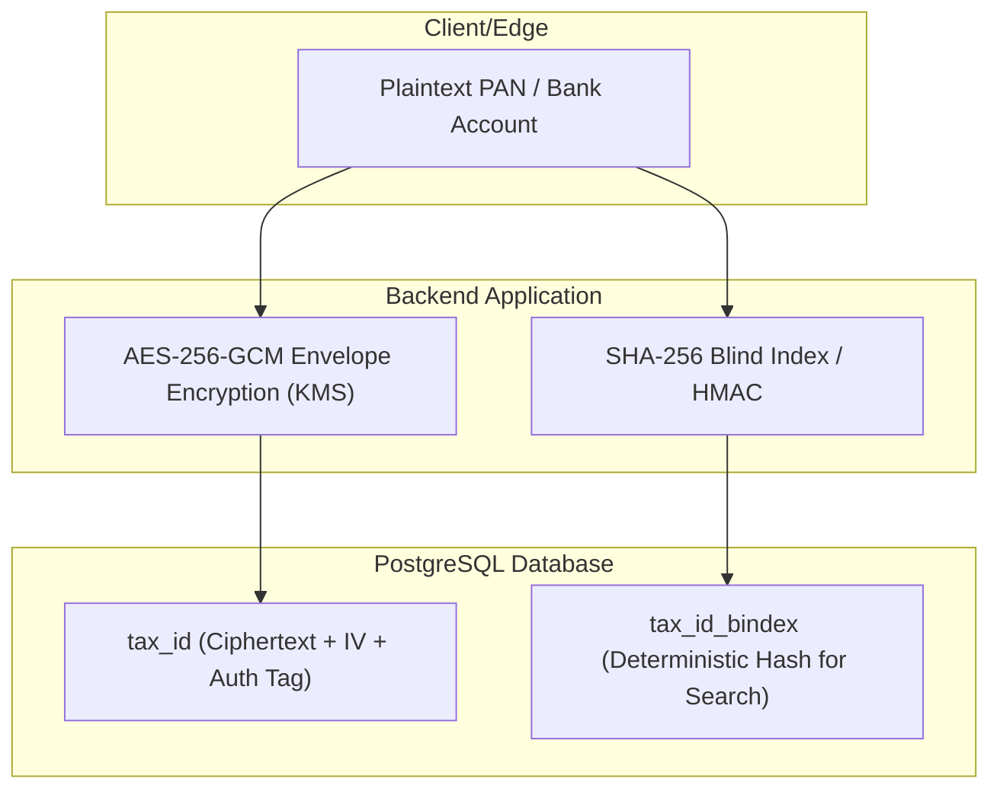

# EKhum (DanaPro / Philanthropy OS) — Complete Data Model & Schema Architecture

---

## 1. Architectural Overview & Design Philosophy

EKhum utilizes an enterprise-grade, relational data architecture on **PostgreSQL 15+** engineered to support multi-tenant non-profit operations, high-frequency donation checkouts, recurring sponsorship mandates, omnichannel communications, and airtight statutory tax compliance (Indian Section 80G & Form 10BD).

### Core Data Principles
1. **Parametric Multi-Tenancy**: Every operational entity is strictly scoped to an `organization_id` (UUID foreign key with `ON DELETE CASCADE` or `RESTRICT` where audit defense requires immutability).
2. **Immutable Audit & Financial Snapshots**: Tax receipts (80G certificates) and ledger transactions maintain point-in-time snapshots of donor PAN, organization registration numbers, and addresses to protect against retroactive profile updates.
3. **Hybrid Relational & JSONB Storage**: Core relational entities enforce referential integrity and relational queries, while dynamic schemas (custom form fields, dynamic gateway responses, visual journey step configurations) utilize JSONB columns indexed with GIN.
4. **Idempotency & Concurrency Safety**: All payment transactions, webhook deliveries, and event triggers enforce unique idempotency keys to prevent double-debits or duplicate receipts.
5. **Zero-Trust Field Encryption**: Sensitive data (PAN numbers, bank account details, donor phone numbers) leverage AES-256-GCM field-level encryption or cryptographic hashing before persistence.

---

## 2. High-Level Entity Relationship Diagram (ERD)

```mermaid
erDiagram
    SUPERADMINS ||--o{ SYSTEM_SETTINGS : manages
    ORGANIZATIONS ||--o{ ORGANIZATION_MEMBERS : employs
    ORGANIZATIONS ||--o{ ROLES : defines
    ORGANIZATIONS ||--o{ CAMPAIGNS : runs
    ORGANIZATIONS ||--o{ DONORS : manages
    ORGANIZATIONS ||--o{ SUBSCRIPTIONS : processes
    ORGANIZATIONS ||--o{ DONATIONS : collects
    ORGANIZATIONS ||--o{ EIGHTY_G_RECEIPTS : issues
    ORGANIZATIONS ||--o{ TEN_BD_EXPORTS : files
    ORGANIZATIONS ||--o{ JOURNEYS : orchestrates
    ORGANIZATIONS ||--o{ BROADCASTS : sends
    ORGANIZATIONS ||--o{ TEMPLATES : customizes
    ORGANIZATIONS ||--o{ API_KEYS : authorizes
    ORGANIZATIONS ||--o{ API_INTEGRATIONS : dispatches

    CAMPAIGNS ||--o{ LANDING_PAGES : publishes
    CAMPAIGNS ||--o{ DONATIONS : attributes
    CAMPAIGNS ||--o{ SUBSCRIPTIONS : attributes
    LANDING_PAGES ||--o{ LANDING_PAGE_SESSIONS : captures

    DONORS ||--o{ SUBSCRIPTIONS : pledges
    DONORS ||--o{ MANDATES : registers
    DONORS ||--o{ DONATIONS : transacts
    DONORS ||--o{ EIGHTY_G_RECEIPTS : receives
    DONORS ||--o{ CONSENTS : grants
    DONORS ||--o{ JOURNEY_ENROLMENTS : participates

    SUBSCRIPTIONS ||--o{ MANDATES : binds
    SUBSCRIPTIONS ||--o{ DONATIONS : generates

    DONATIONS ||--o| EIGHTY_G_RECEIPTS : generates
    DONATIONS ||--o{ EVENTS : fires

    JOURNEYS ||--o{ JOURNEY_STEPS : contains
    JOURNEYS ||--o{ JOURNEY_ENROLMENTS : tracks
    JOURNEY_STEPS ||--o{ EMAIL_COMMUNICATIONS : triggers
    JOURNEY_STEPS ||--o{ WHATSAPP_COMMUNICATIONS : triggers

    SEGMENTS ||--o{ JOURNEYS : triggers
    SEGMENTS ||--o{ BROADCASTS : targets
    SEGMENTS ||--o{ REPORTS : visualizes
    DASHBOARDS ||--o{ DASHBOARD_WIDGETS : displays
    REPORTS ||--o{ DASHBOARD_WIDGETS : feeds
```



---

## 3. Core Database Tables & Data Dictionary

### 3.1 Platform Identity & Organization Tenancy

#### Table: `superadmins`
Stores root platform operators who govern global multi-tenant settings and monitor ecosystem health.

| Column | Type | Constraints | Description |
|---|---|---|---|
| `id` | UUID | PRIMARY KEY, DEFAULT `gen_random_uuid()` | Unique superadmin ID |
| `email` | VARCHAR(255) | UNIQUE, NOT NULL | Login email address |
| `password_hash` | VARCHAR(255) | NOT NULL | Argon2 / Bcrypt hash |
| `created_at` | TIMESTAMPTZ | DEFAULT `CURRENT_TIMESTAMP` | Account creation timestamp |

#### Table: `organizations`
Stores tenant NGO profiles, tax registrations, gateway credentials, and branding settings.

| Column | Type | Constraints | Description |
|---|---|---|---|
| `id` | UUID | PRIMARY KEY, DEFAULT `gen_random_uuid()` | Unique tenant identifier |
| `name` | VARCHAR(255) | NOT NULL | Display name of the NGO/Foundation |
| `legal_name` | VARCHAR(255) | NULL | Official registered legal entity name |
| `slug` | VARCHAR(255) | UNIQUE, NOT NULL | URL identifier for public checkout pages |
| `api_key` | VARCHAR(255) | UNIQUE | Org-level default public API key |
| `logo_url` | VARCHAR(2048) | NULL | S3/CDN URL for NGO logo |
| `tax_id_country` | VARCHAR(10) | NOT NULL | ISO Country code (e.g., `IN`, `US`) |
| `organisation_pan` | VARCHAR(20) | NULL | Indian Income Tax PAN of the NGO |
| `eighty_g_urn` | VARCHAR(100) | NULL | Section 80G Unique Registration Number |
| `eighty_g_approval_date` | DATE | NULL | Date 80G approval was granted by CBDT |
| `eighty_g_valid_until` | DATE | NULL | Expiration date of 80G certificate |
| `twelve_a_registration` | VARCHAR(100) | NULL | Section 12A registration reference |
| `fcra_number` | VARCHAR(100) | NULL | Foreign Contribution Regulation Act ID |
| `csr_registration` | VARCHAR(100) | NULL | MCA Form CSR-1 registration number |
| `registered_address` | TEXT | NULL | Registered address printed on 80G receipts |
| `signatory_name` | VARCHAR(255) | NULL | Authorized officer name for receipt signing |
| `signatory_designation` | VARCHAR(255) | NULL | Designation (e.g., Trustee, Director) |
| `signature_image_url` | VARCHAR(2048) | NULL | Secure S3 URL to digitized signature PNG |
| `receipt_number_prefix` | VARCHAR(50) | NULL | Custom serial prefix (e.g., `CF-2024-`) |
| `primary_currency` | VARCHAR(3) | DEFAULT `'INR'` | ISO Currency code (`INR`, `USD`, `EUR`) |
| `platform_fee_percent` | NUMERIC(5,2) | DEFAULT `0.00` | Platform commission rate (0.00% standard) |
| `sender_name` | VARCHAR(255) | NULL | Email/WhatsApp display sender name |
| `reply_to_email` | VARCHAR(255) | NULL | Operational reply-to inbox |
| `ses_verified_identity` | VARCHAR(255) | NULL | AWS SES verified domain / email address |
| `waba_id` | VARCHAR(255) | NULL | WhatsApp Business Account ID |
| `phone_number_id` | VARCHAR(255) | NULL | Meta Cloud API Phone Number ID |
| `enabled_gateways` | JSONB | DEFAULT `'["razorpay"]'` | Array of active gateway rails |
| `gateway_credentials` | JSONB | DEFAULT `'{}'` | KMS-encrypted gateway keys & secrets |
| `tax_compliance_config`| JSONB | DEFAULT `'{}'` | Form 10BD & 80G layout configuration |
| `payment_gateways_config`| JSONB | DEFAULT `'{}'` | Routing priority, timeout, and failover rules |
| `whatsapp_meta_config` | JSONB | DEFAULT `'{}'` | Meta WABA tokens and webhook secrets |
| `certificate_80g_config`| JSONB | DEFAULT `'{}'` | PDF design layout, CSS, and watermarks |
| `permissions` | JSONB | DEFAULT `'{}'` | Enabled feature flags for this tenant |
| `status` | VARCHAR(50) | DEFAULT `'active'` | `'active'`, `'suspended'`, `'pending_kyc'` |
| `created_at` | TIMESTAMPTZ | DEFAULT `CURRENT_TIMESTAMP` | Org creation timestamp |

#### Table: `organization_members`
Stores NGO staff members, administrators, and campaign managers.

| Column | Type | Constraints | Description |
|---|---|---|---|
| `id` | UUID | PRIMARY KEY, DEFAULT `gen_random_uuid()` | Member identifier |
| `organization_id` | UUID | NOT NULL, REFERENCES `organizations(id)` ON DELETE CASCADE | Scoped organization |
| `email` | VARCHAR(255) | NOT NULL | Member login email |
| `password_hash` | VARCHAR(255) | NOT NULL | Argon2 / Bcrypt password hash |
| `role` | VARCHAR(50) | DEFAULT `'admin'` | Role slug (`super_admin`, `ngo_admin`, etc.) |
| `created_at` | TIMESTAMPTZ | DEFAULT `CURRENT_TIMESTAMP` | Timestamp of invite/creation |

#### Table: `roles`
Defines granular Role-Based Access Control (RBAC) permissions per tenant.

| Column | Type | Constraints | Description |
|---|---|---|---|
| `id` | UUID | PRIMARY KEY, DEFAULT `gen_random_uuid()` | Role ID |
| `organization_id` | UUID | NOT NULL, REFERENCES `organizations(id)` ON DELETE CASCADE | Scoped tenant |
| `name` | VARCHAR(100) | NOT NULL | Technical role name |
| `display_name` | VARCHAR(255) | NULL | Human readable title |
| `description` | TEXT | NULL | Scope summary |
| `is_system` | BOOLEAN | DEFAULT `false` | System-reserved non-deletable role |
| `permissions` | JSONB | DEFAULT `'{}'` | Map of resource permissions `{ "donations:read": true, "donations:refund": false }` |
| `created_at` | TIMESTAMPTZ | DEFAULT `CURRENT_TIMESTAMP` | Timestamp |

---

### 3.2 Campaigns, Landing Pages & Session Tracking

#### Table: `campaigns`
Stores fundraising initiatives, appeals, and sponsorship programmes.

| Column | Type | Constraints | Description |
|---|---|---|---|
| `id` | UUID | PRIMARY KEY, DEFAULT `gen_random_uuid()` | Unique campaign ID |
| `organization_id` | UUID | NOT NULL, REFERENCES `organizations(id)` ON DELETE CASCADE | Owning organization |
| `title` | VARCHAR(255) | NOT NULL | Campaign name |
| `campaign_code` | VARCHAR(100) | NULL | Internal accounting code |
| `description` | TEXT | NULL | Rich markdown campaign description |
| `slug` | VARCHAR(255) | UNIQUE, NOT NULL | Public URL path component |
| `api_key` | VARCHAR(255) | UNIQUE | Campaign-specific checkout API key |
| `campaign_type` | VARCHAR(20) | DEFAULT `'online'` | `'online'`, `'offline'`, `'p2p'`, `'telecalling'` |
| `channel` | VARCHAR(50) | NULL | Primary marketing channel |
| `cause_or_programme` | VARCHAR(255) | NULL | Focus sector (Child Welfare, Healthcare, etc.) |
| `start_date` | DATE | NULL | Campaign launch date |
| `end_date` | DATE | NULL | Campaign sunset date |
| `goal_amount` | NUMERIC(12,2)| DEFAULT `0.00` | Target financial goal in primary currency |
| `target_signups` | INTEGER | DEFAULT `0` | Target recurring sponsor volume |
| `default_frequency` | VARCHAR(20) | DEFAULT `'both'` | `'one_time'`, `'monthly'`, `'both'` |
| `default_ask_amounts`| JSONB | DEFAULT `'[500, 1000, 2500, 5000]'` | Pre-configured donation amount chips |
| `minimum_amount` | NUMERIC(12,2)| DEFAULT `1.00` | Floor minimum allowed gift |
| `landing_page_url` | VARCHAR(2048)| NULL | Custom external URL |
| `allowed_gateways` | JSONB | DEFAULT `'["razorpay"]'` | Enabled gateway subset for this campaign |
| `form_fields` | JSONB | DEFAULT `'[]'` | Dynamic custom fields collected at checkout |
| `payment_config` | JSONB | DEFAULT `'{}'` | Fee-cover toggle, default frequency configs |
| `permissions` | JSONB | DEFAULT `'{}'` | Anonymous allowed, 80G eligibility flags |
| `is_active` | BOOLEAN | DEFAULT `TRUE` | Enable/disable giving on this campaign |
| `created_at` | TIMESTAMPTZ | DEFAULT `CURRENT_TIMESTAMP` | Campaign creation timestamp |

#### Table: `landing_pages`
Stores individual high-converting variants and customizable giving page designs.

| Column | Type | Constraints | Description |
|---|---|---|---|
| `id` | UUID | PRIMARY KEY, DEFAULT `gen_random_uuid()` | Page identifier |
| `organization_id` | UUID | NOT NULL, REFERENCES `organizations(id)` ON DELETE CASCADE | Owning organization |
| `campaign_id` | UUID | NOT NULL, REFERENCES `campaigns(id)` ON DELETE CASCADE | Associated campaign |
| `url_slug` | VARCHAR(255) | NOT NULL | Custom subpath slug |
| `page_title` | VARCHAR(500) | NULL | HTML document title |
| `meta_description` | TEXT | NULL | SEO metadata |
| `template` | VARCHAR(100) | NULL | UI Layout engine template ID |
| `form_field_config` | JSONB | DEFAULT `'[]'` | Field arrangement & validation schema |
| `hero_media_url` | VARCHAR(2048)| NULL | Hero video / banner image asset URL |
| `variant_label` | VARCHAR(100) | NULL | A/B Testing variant identifier (`A`, `B`, `Mobile_V2`) |
| `status` | VARCHAR(50) | DEFAULT `'draft'` | `'draft'`, `'published'`, `'archived'` |
| `published_at` | TIMESTAMPTZ | NULL | Publication timestamp |
| `created_at` | TIMESTAMPTZ | DEFAULT `CURRENT_TIMESTAMP` | Created date |

#### Table: `landing_page_sessions`
Tracks anonymous visitor telemetry, UTM conversion funnels, and drop-off analytics.

| Column | Type | Constraints | Description |
|---|---|---|---|
| `id` | UUID | PRIMARY KEY, DEFAULT `gen_random_uuid()` | Session tracking ID |
| `organization_id` | UUID | NOT NULL, REFERENCES `organizations(id)` ON DELETE CASCADE | Owning organization |
| `landing_page_id` | UUID | REFERENCES `landing_pages(id)` ON DELETE SET NULL | Page visited |
| `campaign_id` | UUID | REFERENCES `campaigns(id)` ON DELETE SET NULL | Campaign visited |
| `contact_id` | UUID | REFERENCES `donors(id)` ON DELETE SET NULL | Identified donor (if logged in/submitted) |
| `started_at` | TIMESTAMPTZ | DEFAULT `CURRENT_TIMESTAMP` | Visit timestamp |
| `utm_source` | VARCHAR(255) | NULL | Traffic source (`meta`, `google`, `whatsapp`) |
| `utm_medium` | VARCHAR(255) | NULL | Medium (`cpc`, `email`, `broadcast`) |
| `utm_campaign` | VARCHAR(255) | NULL | Campaign identifier |
| `ip_address_hash` | VARCHAR(64) | NULL | Cryptographic SHA-256 hash of IP (GDPR/DPDP safe) |
| `device_type` | VARCHAR(50) | NULL | `'mobile'`, `'desktop'`, `'tablet'` |
| `form_started` | BOOLEAN | DEFAULT `false` | True when donor focuses first input |
| `form_submitted` | BOOLEAN | DEFAULT `false` | True when donor clicks Give Now |
| `gateway_redirected`| BOOLEAN | DEFAULT `false` | True when routed to gateway SDK/checkout |
| `outcome` | VARCHAR(50) | NULL | `'converted'`, `'abandoned'`, `'failed'` |
| `payment_id` | UUID | NULL | Final linked payment record |

---

### 3.3 CRM Donors, Contacts & Consent Management

#### Table: `donors` (Contacts)
Master constituent record storing personal identity, lifetime giving metrics, RFM score, and tax identifiers.

| Column | Type | Constraints | Description |
|---|---|---|---|
| `id` | UUID | PRIMARY KEY, DEFAULT `gen_random_uuid()` | Master Contact ID |
| `organization_id` | UUID | NOT NULL, REFERENCES `organizations(id)` ON DELETE CASCADE | Owning organization |
| `title` | VARCHAR(20) | NULL | Prefix (`Mr.`, `Ms.`, `Dr.`) |
| `first_name` | VARCHAR(255) | NULL | First name |
| `last_name` | VARCHAR(255) | NULL | Surname |
| `name` | VARCHAR(255) | NOT NULL | Full consolidated name |
| `email` | VARCHAR(255) | NOT NULL | Primary email address |
| `phone` | VARCHAR(50) | NULL | E.164 normalized mobile number |
| `tax_id` | VARCHAR(100) | NULL | Encrypted Indian PAN / National Tax ID |
| `tax_id_type` | VARCHAR(50) | NULL | `'PAN'`, `'Aadhaar'`, `'Passport'`, `'SSN'` |
| `country` | VARCHAR(10) | NULL | ISO Country Code |
| `street_address_1` | VARCHAR(500) | NULL | Physical address line 1 |
| `city` | VARCHAR(255) | NULL | City |
| `state` | VARCHAR(255) | NULL | State / Province |
| `zip_code` | VARCHAR(10) | NULL | Postal PIN Code |
| `contact_status` | VARCHAR(50) | DEFAULT `'lead'` | `'lead'`, `'active_donor'`, `'recurring_sponsor'`, `'lapsed'` |
| `acquisition_source` | VARCHAR(50)| NULL | Acquisition channel |
| `total_monthly_donations`| INTEGER | DEFAULT `0` | Count of active recurring pledges |
| `total_onetime_donations`| INTEGER | DEFAULT `0` | Count of one-time gifts |
| `total_paid_amount` | NUMERIC(12,2)| DEFAULT `0.00` | Lifetime Value (LTV) in INR |
| `total_gift_count_paid`| INTEGER | DEFAULT `0` | Total completed successful transactions |
| `last_gift_amount_paid`| NUMERIC(12,2)| NULL | Value of most recent donation |
| `first_gift_date` | DATE | NULL | Date of first contribution |
| `last_gift_date` | DATE | NULL | Date of most recent contribution |
| `preferred_channel` | VARCHAR(20) | DEFAULT `'both'` | `'whatsapp'`, `'email'`, `'both'` |
| `metadata` | JSONB | DEFAULT `'{}'` | Dynamic custom field attributes & tags |
| `created_at` | TIMESTAMPTZ | DEFAULT `CURRENT_TIMESTAMP` | Profile creation date |
| `updated_at` | TIMESTAMPTZ | DEFAULT `CURRENT_TIMESTAMP` | Last profile update timestamp |

#### Table: `consents` (DPDP Act 2023 Consent Registry)
Maintains verifiable audit trails of donor communication permissions and explicit opt-ins.

| Column | Type | Constraints | Description |
|---|---|---|---|
| `id` | UUID | PRIMARY KEY, DEFAULT `gen_random_uuid()` | Consent record ID |
| `organization_id` | UUID | NOT NULL, REFERENCES `organizations(id)` ON DELETE CASCADE | Scoped organization |
| `contact_id` | UUID | NOT NULL, REFERENCES `donors(id)` ON DELETE CASCADE | Associated donor |
| `channel` | VARCHAR(20) | NOT NULL | `'whatsapp'`, `'email'`, `'sms'`, `'voice'` |
| `status` | VARCHAR(20) | DEFAULT `'never_given'` | `'opted_in'`, `'opted_out'`, `'never_given'` |
| `source` | VARCHAR(50) | NULL | Source (`checkout_checkbox`, `whatsapp_stop_reply`) |
| `captured_at` | TIMESTAMPTZ | DEFAULT `CURRENT_TIMESTAMP` | Precise timestamp of consent capture |
| `consent_text_version`| TEXT | NULL | Exact disclaimer copy displayed at time of giving |
| `ip_address` | VARCHAR(64) | NULL | IP address of consenting device |
| `withdrawn_at` | TIMESTAMPTZ | NULL | Timestamp of opt-out/withdrawal |
| `withdrawal_source` | VARCHAR(50)| NULL | Method of withdrawal |

---

### 3.4 Recurring Sponsorships, Mandates & Payments

#### Table: `subscriptions` (Monthly Donations)
Governs ongoing child sponsorship and recurring monthly donation pledges.

| Column | Type | Constraints | Description |
|---|---|---|---|
| `id` | UUID | PRIMARY KEY, DEFAULT `gen_random_uuid()` | Subscription identifier |
| `organization_id` | UUID | NOT NULL, REFERENCES `organizations(id)` ON DELETE CASCADE | Owning organization |
| `donor_id` | UUID | NOT NULL, REFERENCES `donors(id)` ON DELETE RESTRICT | Sponsoring donor |
| `campaign_id` | UUID | NOT NULL, REFERENCES `campaigns(id)` ON DELETE RESTRICT | Sponsored campaign/cause |
| `amount` | NUMERIC(12,2)| NOT NULL | Recurring monthly pledge amount |
| `currency` | VARCHAR(3) | NOT NULL | Currency ISO code |
| `interval` | VARCHAR(50) | NOT NULL | `'monthly'`, `'quarterly'`, `'annual'` |
| `status` | VARCHAR(50) | DEFAULT `'active'` | `'active'`, `'paused'`, `'cancelled'`, `'past_due'` |
| `gateway_subscription_id`| VARCHAR(255)| UNIQUE | Gateway subscription reference |
| `consecutive_failed_installments`| INTEGER | DEFAULT `0` | Count of back-to-back failed debits |
| `debit_day_preference` | INTEGER | NULL | Day of month (1–28) preferred for debit |
| `next_billing_date` | TIMESTAMPTZ | NULL | Scheduled date of next recurring charge |
| `paused` | BOOLEAN | DEFAULT `false` | Pause status flag |
| `pause_start_date` | DATE | NULL | Date pause started |
| `pause_end_date` | DATE | NULL | Date automatic debit should resume |
| `value_upgrade` | BOOLEAN | DEFAULT `false` | True if sponsor upgraded giving amount |
| `upgraded_value` | NUMERIC(12,2)| NULL | New amount after upgrade |
| `end_reason` | TEXT | NULL | Cancellation reason provided by donor/staff |
| `created_at` | TIMESTAMPTZ | DEFAULT `CURRENT_TIMESTAMP` | Enrolment timestamp |

#### Table: `mandates`
Manages NPCI e-NACH and UPI Autopay bank mandates.

| Column | Type | Constraints | Description |
|---|---|---|---|
| `id` | UUID | PRIMARY KEY, DEFAULT `gen_random_uuid()` | Mandate ID |
| `organization_id` | UUID | NOT NULL, REFERENCES `organizations(id)` ON DELETE CASCADE | Owning organization |
| `contact_id` | UUID | NOT NULL, REFERENCES `donors(id)` ON DELETE RESTRICT | Account holder |
| `monthly_donation_id`| UUID | REFERENCES `subscriptions(id)` ON DELETE SET NULL | Bound subscription |
| `payment_gateway` | VARCHAR(50) | NOT NULL | Gateway rail (`razorpay`, `payu`, `cashfree`) |
| `mandate_method` | VARCHAR(50) | NOT NULL | `'upi_autopay'`, `'enach_netbanking'`, `'enach_debitcard'` |
| `umrn` | VARCHAR(255) | NULL | NPCI Unique Mandate Reference Number |
| `gateway_mandate_ref`| VARCHAR(255)| NULL | Gateway mandate token ID |
| `bank_name` | VARCHAR(255) | NULL | Issuing bank |
| `account_last_four` | VARCHAR(4) | NULL | Last 4 digits of bank account / VPA handle |
| `max_debit_amount` | NUMERIC(12,2)| NULL | Cap on recurring debit approved by donor |
| `status` | VARCHAR(50) | DEFAULT `'pending'` | `'pending'`, `'active'`, `'rejected'`, `'revoked'` |
| `registered_at` | TIMESTAMPTZ | NULL | Date NPCI/Bank approved the mandate |
| `revoked_at` | TIMESTAMPTZ | NULL | Date mandate was cancelled |

#### Table: `donations` (Payments Ledger)
Immutable financial transaction ledger recording every one-time and recurring gift.

| Column | Type | Constraints | Description |
|---|---|---|---|
| `id` | UUID | PRIMARY KEY, DEFAULT `gen_random_uuid()` | Transaction identifier |
| `organization_id` | UUID | NOT NULL, REFERENCES `organizations(id)` ON DELETE CASCADE | Beneficiary organization |
| `campaign_id` | UUID | NOT NULL, REFERENCES `campaigns(id)` ON DELETE RESTRICT | Credited campaign |
| `donor_id` | UUID | NOT NULL, REFERENCES `donors(id)` ON DELETE RESTRICT | Contributing donor |
| `subscription_id` | UUID | REFERENCES `subscriptions(id)` ON DELETE SET NULL | Bound recurring subscription (if monthly) |
| `amount` | NUMERIC(12,2)| NOT NULL | Gross donation amount |
| `currency` | VARCHAR(3) | NOT NULL | Currency code (`INR`) |
| `fee_covered` | NUMERIC(12,2)| DEFAULT `0.00` | Extra amount added by donor to cover fees |
| `net_amount` | NUMERIC(12,2)| NULL | Net settled funds after gateway deductions |
| `gateway_fee` | NUMERIC(12,2)| NULL | Processing fee charged by gateway |
| `payment_gateway` | VARCHAR(50) | NOT NULL | Processed gateway rail (`razorpay`, `payu`, etc.) |
| `gateway_order_id` | VARCHAR(255)| NULL | Gateway order ID |
| `gateway_payment_id`| VARCHAR(255)| NULL | Gateway charge ID |
| `status` | VARCHAR(50) | DEFAULT `'pending'` | `'pending'`, `'captured'`, `'failed'`, `'refunded'` |
| `payment_method` | VARCHAR(50) | NULL | `'upi'`, `'card'`, `'netbanking'`, `'wallet'` |
| `normalised_failure_code`| VARCHAR(100)| NULL | Standardized code (`INSUFFICIENT_FUNDS`, `EXPIRED_VPA`) |
| `idempotency_key` | VARCHAR(255)| UNIQUE | Prevents double ledger entry |
| `settlement_date` | DATE | NULL | Date funds deposited into NGO bank account |
| `settlement_utr` | VARCHAR(255)| NULL | Bank Unique Transaction Reference |
| `is_anonymous` | BOOLEAN | DEFAULT `FALSE` | Suppress name on public leaderboards |
| `tax_receipt_status`| VARCHAR(50)| DEFAULT `'not_generated'`| `'not_generated'`, `'generated'`, `'delivered'` |
| `raw_gateway_response`| JSONB | DEFAULT `'{}'` | Full raw webhook JSON from gateway rail |
| `created_at` | TIMESTAMPTZ | DEFAULT `CURRENT_TIMESTAMP` | Payment timestamp |

---

### 3.5 Statutory Tax Compliance (Section 80G & Form 10BD)

#### Table: `eighty_g_receipts`
Stores immutable, audit-proof Section 80G tax exemption certificates.

| Column | Type | Constraints | Description |
|---|---|---|---|
| `id` | UUID | PRIMARY KEY, DEFAULT `gen_random_uuid()` | Receipt ID |
| `organization_id` | UUID | NOT NULL, REFERENCES `organizations(id)` ON DELETE CASCADE | Issuing NGO |
| `contact_id` | UUID | NOT NULL, REFERENCES `donors(id)` ON DELETE RESTRICT | Donor recipient |
| `payment_id` | UUID | NOT NULL, REFERENCES `donations(id)` ON DELETE RESTRICT | Associated transaction |
| `receipt_number` | VARCHAR(100) | NOT NULL | Sequential certificate number |
| `financial_year` | VARCHAR(10) | NOT NULL | Indian FY string (`2024-2025`) |
| `donation_date` | DATE | NOT NULL | Date donation was settled |
| `amount` | NUMERIC(12,2)| NOT NULL | Certified exempt contribution |
| `donor_name_snapshot`| VARCHAR(500)| NOT NULL | Donor legal name snapshot at issue time |
| `donor_pan_snapshot` | VARCHAR(20) | NULL | Donor PAN snapshot at issue time |
| `donor_address_snapshot`| TEXT | NULL | Donor residential address snapshot |
| `organisation_urn_snapshot`| VARCHAR(100)| NULL | NGO 80G URN at issue time |
| `organisation_pan_snapshot`| VARCHAR(20) | NULL | NGO PAN at issue time |
| `signatory_snapshot`| VARCHAR(255)| NULL | Signatory name and designation |
| `pdf_url` | VARCHAR(2048)| NOT NULL | Secure S3 pre-signed / public CDN PDF URL |
| `transaction_hash` | CHAR(64) | NOT NULL | SHA-256 tamper-evident integrity hash |
| `email_delivery_status`| VARCHAR(50)| DEFAULT `'pending'` | `'pending'`, `'sent'`, `'delivered'`, `'failed'` |
| `whatsapp_delivery_status`| VARCHAR(50)| DEFAULT `'pending'` | `'pending'`, `'sent'`, `'delivered'`, `'failed'` |
| `download_count` | INTEGER | DEFAULT `0` | Number of times downloaded by donor |
| `reissued` | BOOLEAN | DEFAULT `false` | True if amended/reissued certificate |
| `voided` | BOOLEAN | DEFAULT `false` | True if transaction was refunded/voided |
| `included_in_10bd` | BOOLEAN | DEFAULT `false` | Flag indicating inclusion in annual 10BD return |
| `generated_at` | TIMESTAMPTZ | DEFAULT `CURRENT_TIMESTAMP` | Generation timestamp |

#### Table: `ten_bd_exports`
Maintains annual statutory Form 10BD reconciliation batches for direct upload to the CBDT e-Filing portal.

| Column | Type | Constraints | Description |
|---|---|---|---|
| `id` | UUID | PRIMARY KEY, DEFAULT `gen_random_uuid()` | Filing batch ID |
| `organization_id` | UUID | NOT NULL, REFERENCES `organizations(id)` ON DELETE CASCADE | Filing organization |
| `financial_year` | VARCHAR(10) | NOT NULL | FY (`2024-2025`) |
| `record_count` | INTEGER | DEFAULT `0` | Total compliant donations included |
| `total_amount` | NUMERIC(14,2)| DEFAULT `0.00` | Gross certified donation value |
| `excluded_record_count`| INTEGER | DEFAULT `0` | Count of non-compliant records excluded (missing PAN/Address) |
| `exclusion_reasons` | JSONB | DEFAULT `'[]'` | Audit breakdown of skipped transactions |
| `csv_file_url` | VARCHAR(2048)| NULL | Generated CBDT-compliant CSV file URL |
| `filing_status` | VARCHAR(50) | DEFAULT `'draft'` | `'draft'`, `'generated'`, `'filed'`, `'accepted'` |
| `filed_date` | DATE | NULL | Date submitted to Income Tax portal |
| `acknowledgement_number`| VARCHAR(255)| NULL | ITD ARN (Acknowledgement Reference Number) |
| `generated_at` | TIMESTAMPTZ | DEFAULT `CURRENT_TIMESTAMP` | Batch generation timestamp |

---

### 3.6 Event Bus, Journeys & Omnichannel Communications

#### Table: `events`
High-throughput event queue powering the real-time 11-trigger reactive engine.

| Column | Type | Constraints | Description |
|---|---|---|---|
| `id` | UUID | PRIMARY KEY, DEFAULT `gen_random_uuid()` | Event ID |
| `organization_id` | UUID | NOT NULL, REFERENCES `organizations(id)` ON DELETE CASCADE | Scoped organization |
| `event_type` | VARCHAR(100) | NOT NULL | Event trigger (`donation.completed`, etc.) |
| `contact_id` | UUID | REFERENCES `donors(id)` ON DELETE SET NULL | Associated donor |
| `payment_id` | UUID | REFERENCES `donations(id)` ON DELETE SET NULL | Associated donation |
| `monthly_donation_id`| UUID | REFERENCES `subscriptions(id)` ON DELETE SET NULL | Associated subscription |
| `payload` | JSONB | DEFAULT `'{}'` | Full contextual event payload |
| `idempotency_key` | VARCHAR(255)| UNIQUE | Prevents duplicate event processing |
| `processing_status` | VARCHAR(20) | DEFAULT `'pending'` | `'pending'`, `'processing'`, `'completed'`, `'failed'` |
| `retry_count` | INTEGER | DEFAULT `0` | Failed execution retry counter |
| `occurred_at` | TIMESTAMPTZ | DEFAULT `CURRENT_TIMESTAMP` | Timestamp event happened |

#### Table: `journeys` & `journey_steps` & `journey_enrolments`
Powers the visual drag-and-drop donor automation engine.

- **`journeys`**: Configures the journey triggers, re-entry rules, exit goals, and active versions.
- **`journey_steps`**: Defines individual graph nodes (Delays, Condition branches, WhatsApp templates, Email dispatches, Quiet-hours rules).
- **`journey_enrolments`**: Tracks active donor state machines, current node pointers, and scheduled wake-up timestamps.

#### Table: `whatsapp_communications` & `email_communications`
Dispatches, delivery webhooks, read-receipts, open tracking, and cost ledger for all outbound communications.

---

### 3.7 Dynamic Schemas, Reporting & API Gateway

- **`field_definitions`**: Admin-managed custom attributes attached to Donors, Donations, or Campaigns with type safety (Text, Picklist, Currency, Date, Formula).
- **`segments`**: Dynamic SQL/JSONB audience query definitions with real-time membership calculation.
- **`reports` & `dashboards` & `dashboard_widgets`**: Drag-and-drop analytics builder storing chart configurations, aggregated metrics, and role-based widget visibility.
- **`api_keys`**: Cryptographically hashed tenant API keys (`sha256(prefix + secret)`) with rate limiting and granular scope enforcement (`donations:write`, `reports:read`).
- **`api_integrations` & `api_logs`**: Outbound webhook delivery system with HMAC-SHA256 signature verification and exponential backoff retries.
- **`audit_logs`**: Immutable security log capturing every administrative read, write, export, and authentication attempt.

---

## 4. Indexing & Query Optimization Blueprint

To guarantee sub-50ms API response times under high-concurrency giving surges, the following PostgreSQL indexes are deployed:

```sql
-- 1. Tenant & Lookup Fast-Paths
CREATE INDEX idx_donors_org_email ON donors(organization_id, email);
CREATE INDEX idx_donors_org_phone ON donors(organization_id, phone);
CREATE INDEX idx_donations_org_status ON donations(organization_id, status);
CREATE INDEX idx_donations_created_at ON donations(created_at DESC);
CREATE INDEX idx_donations_idempotency ON donations(idempotency_key);

-- 2. Compliance & Fiscal Lookups
CREATE INDEX idx_80g_receipts_fy_org ON eighty_g_receipts(organization_id, financial_year);
CREATE INDEX idx_80g_receipts_donor ON eighty_g_receipts(contact_id);

-- 3. Event Queue & Worker Polling Indexes
CREATE INDEX idx_events_pending ON events(processing_status, occurred_at) WHERE processing_status = 'pending';
CREATE INDEX idx_journey_enrolments_wake ON journey_enrolments(status, next_action_due_at) WHERE status = 'active';

-- 4. Dynamic JSONB Indexing (GIN)
CREATE INDEX idx_donors_metadata_gin ON donors USING GIN (metadata);
CREATE INDEX idx_campaigns_form_fields_gin ON campaigns USING GIN (form_fields);
CREATE INDEX idx_events_payload_gin ON events USING GIN (payload);
```

---

## 5. DPDP Act 2023 & PII Field Encryption Architecture



1. **Envelope Encryption**: Sensitive tax IDs (PAN, Aadhaar) and bank account numbers are encrypted application-side using AES-256-GCM before writing to PostgreSQL.
2. **Blind Indexing**: To allow exact-match search (e.g., locating an existing donor by PAN during checkout) without decrypting the entire database, a keyed HMAC-SHA256 blind index is stored alongside the ciphertext.
3. **Decryption on Demand**: Decryption keys reside exclusively in secure environment memory / AWS KMS; the raw database backup contains zero readable tax identifiers or bank accounts.
