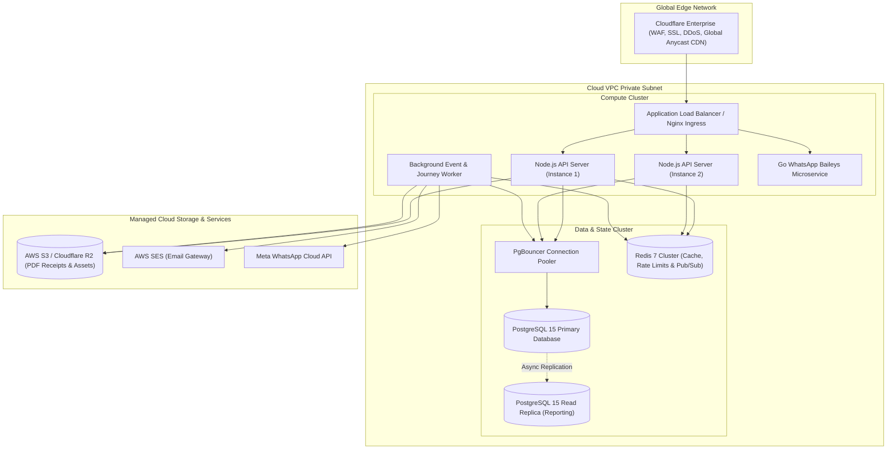
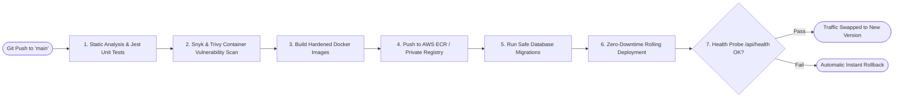

# EKhum (DanaPro / Philanthropy OS) — Deployment & Cloud Infrastructure Blueprint

---

## 1. Cloud Architecture & Infrastructure Topography

EKhum is engineered for cloud-agnostic deployment across **AWS / Render / DigitalOcean / Dedicated Bare-Metal** with automated elasticity, multi-AZ resilience, and zero-trust private networking.



---

## 2. Docker & Containerization Blueprint

The platform uses multi-stage, hardened Docker containers executing as non-root users.

### Backend `Dockerfile`
```dockerfile
# Stage 1: Build & TypeScript Compilation
FROM node:20-alpine AS builder
WORKDIR /app
COPY package*.json tsconfig.json ./
RUN npm ci
COPY src ./src
RUN npm run build

# Stage 2: Production Minimal Runtime
FROM node:20-alpine AS runner
WORKDIR /app

ENV NODE_ENV=production
ENV PORT=5000

# Install security updates
RUN apk update && apk upgrade && apk add --no-cache dumb-init

# Create non-root user
USER node

COPY package*.json ./
RUN npm ci --only=production

COPY --from=builder --chown=node:node /app/dist ./dist
COPY --from=builder --chown=node:node /app/public ./public

EXPOSE 5000

ENTRYPOINT ["/usr/bin/dumb-init", "--"]
CMD ["node", "dist/index.js"]
```

---

## 3. Database Connection Pooling (PgBouncer)

To prevent PostgreSQL connection exhaustion during viral fundraising events, PgBouncer is deployed with transaction pooling:

```ini
[databases]
ekhum_db = host=127.0.0.1 port=5432 dbname=ekhum_production pool_mode=transaction

[pgbouncer]
listen_port = 6432
listen_addr = 0.0.0.0
auth_type = scram-sha-256
auth_file = /etc/pgbouncer/userlist.txt
max_client_conn = 5000
default_pool_size = 50
min_pool_size = 10
reserve_pool_size = 10
max_db_connections = 100
server_idle_timeout = 60
client_idle_timeout = 60
query_timeout = 30
```

---

## 4. Continuous Integration & Continuous Deployment (CI/CD)



---

## 5. High Availability, Scalability & Disaster Recovery Runbook

### Key SLA & Metrics
- **Uptime Target**: 99.95% (Multi-AZ deployment).
- **Auto-Scaling Policy**: CPU > 70% or P95 Latency > 250ms spawns additional container instances within 45 seconds.
- **RPO (Recovery Point Objective)**: < 5 minutes via continuous PostgreSQL WAL streaming to encrypted S3.
- **RTO (Recovery Time Objective)**: < 30 minutes to spin up a cold replica in an alternate region.

### Backup Schedule
1. **Continuous**: PostgreSQL WAL streaming to AWS S3 / Cloudflare R2 with cross-region replication.
2. **Daily at 02:00 UTC**: Full `pg_dump` compressed and encrypted with AES-256-GCM.
3. **Weekly**: Automated restoration test executed in an isolated sandbox to verify backup integrity.
