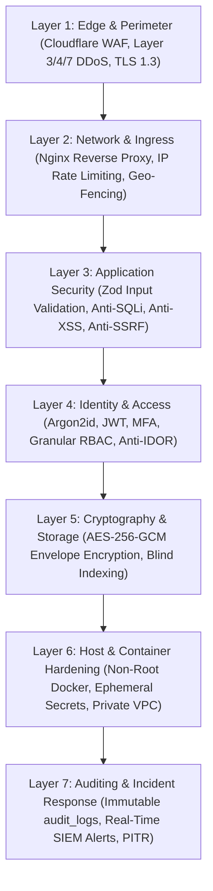
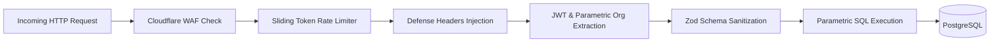
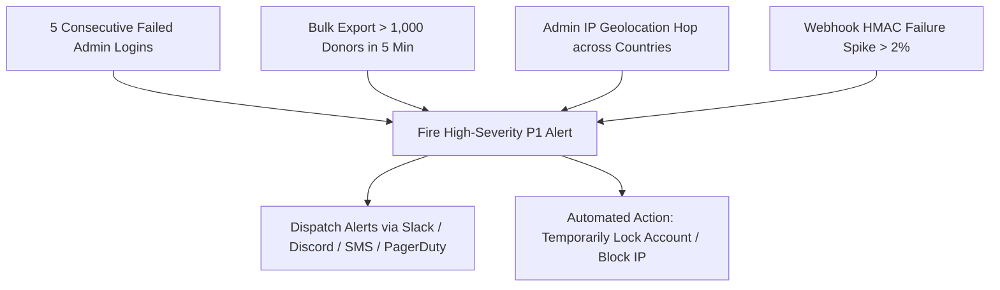

# EKhum (DanaPro / Philanthropy OS) — Master Software Security & Breach Defense Plan

---

## 🛡️ Executive Summary & Security Philosophy

As an enterprise fintech and philanthropy platform handling millions in financial donations, highly sensitive donor Personally Identifiable Information (PII), Indian Income Tax identifiers (PAN cards, Aadhaar), and bank mandate credentials (NPCI e-NACH & UPI Autopay), **EKhum** operates under a **Zero-Trust, Defense-in-Depth (DiD)** security architecture.

This master security plan outlines the policies, cryptographic controls, network topologies, application defenses, incident response protocols, and statutory compliance frameworks (DPDP Act 2023, Section 80G, CERT-In, and PCI-DSS) that protect EKhum against **data breaches**, **server intrusions**, **unauthorized tenant cross-talk (IDOR)**, and **infrastructure outages**.

---

## 📑 Security Architecture Table of Contents

1. [7-Layer Defense-in-Depth Framework](#1-7-layer-defense-in-depth-framework)
2. [Data Protection & Cryptographic Security Plan](#2-data-protection--cryptographic-security-plan)
3. [Application Layer & API Gateway Defense Plan](#3-application-layer--api-gateway-defense-plan)
4. [Identity, Authentication & Access Control (RBAC)](#4-identity-authentication--access-control-rbac)
5. [Network, Edge & Server Hardening Plan](#5-network-edge--server-hardening-plan)
6. [Statutory Compliance & Privacy Governance (DPDP Act 2023)](#6-statutory-compliance--privacy-governance-dpdp-act-2023)
7. [SIEM, Audit Logging & Real-Time Anomaly Detection](#7-siem-audit-logging--real-time-anomaly-detection)
8. [Incident Response, Disaster Recovery & Business Continuity](#8-incident-response-disaster-recovery--business-continuity)
9. [Vulnerability Management & Penetration Testing Roadmap](#9-vulnerability-management--penetration-testing-roadmap)

---

## 1. 7-Layer Defense-in-Depth Framework



---

## 2. Data Protection & Cryptographic Security Plan

### 2.1 Field-Level Envelope Encryption (AES-256-GCM)
Sensitive constituent data (PAN numbers, Aadhaar IDs, bank account numbers) is encrypted application-side using **AES-256-GCM** before writing to PostgreSQL.

- **Master Key**: 256-bit high-entropy cryptographic key injected via AWS Secrets Manager / KMS.
- **Initialization Vector (IV)**: A unique, cryptographically random 12-byte (96-bit) IV is generated for *every single field write*. Identical PANs result in completely different ciphertexts.
- **Authentication Tag**: 16-byte (128-bit) integrity checksum verifying ciphertext authenticity and detecting database tampering.
- **Envelope Storage Format**:
  $$\text{tax\_id} = \text{"enc:v1:"} + \text{Base64}(\text{IV}) + \text{":"} + \text{Base64}(\text{AuthTag}) + \text{":"} + \text{Base64}(\text{Ciphertext})$$

### 2.2 Searchable Blind Indexing (HMAC-SHA256)
To allow sub-millisecond exact-match lookups (`WHERE tax_id_bindex = $1`) without decrypting database rows or exposing raw PAN numbers in index files:
$$\text{tax\_id\_bindex} = \text{HMAC-SHA256}(K_{\text{blind}}, \text{UPPER}(\text{TRIM}(\text{PAN})))$$

### 2.3 Data-at-Rest & In-Transit Encryption
- **Data in Transit**: Enforced TLS 1.3 with Perfect Forward Secrecy (PFS). Non-HTTPS traffic is permanently rejected.
- **Data at Rest**: PostgreSQL storage volumes, Redis caches, and S3 receipt buckets use hardware-level AES-256 disk encryption (AWS KMS / SSE-S3).

---

## 3. Application Layer & API Gateway Defense Plan



### 3.1 HTTP Security Defense Headers
All HTTP responses include strict security headers:
- `Strict-Transport-Security: max-age=31536000; includeSubDomains; preload`
- `X-Content-Type-Options: nosniff`
- `X-Frame-Options: SAMEORIGIN`
- `Content-Security-Policy: default-src 'self'; script-src 'self' https://checkout.razorpay.com; frame-src https://api.razorpay.com;`
- `Permissions-Policy: camera=(), microphone=(), geolocation=()`

### 3.2 SQL Injection & Parametric Query Governance
- Zero dynamic string concatenation in SQL queries.
- All database operations strictly use parameterized bindings (`$1, $2, ...`) via `pg` connection pools.

### 3.3 Anti-SSRF (Server-Side Request Forgery) Safe Webhook Dispatcher
Outbound NGO webhook URLs are verified prior to socket connection:
- Blocks private IPv4 ranges: `10.0.0.0/8`, `172.16.0.0/12`, `192.168.0.0/16`, `100.64.0.0/10`.
- Blocks loopback: `127.0.0.1`, `localhost`, `::1`.
- Blocks Cloud Metadata endpoints: `169.254.169.254`.

### 3.4 Webhook Cryptographic Signature Verification
Inbound webhooks (Razorpay, PayU, Meta WhatsApp) undergo constant-time HMAC-SHA256 verification using `crypto.timingSafeEqual` to prevent side-channel timing attacks.

---

## 4. Identity, Authentication & Access Control (RBAC)

### 4.1 Credential & Session Governance
- **Password Hashing**: Argon2id / Bcrypt (Work factor $\ge 12$).
- **Authentication Tokens**: Short-lived JWT access tokens (15-minute expiry) paired with HttpOnly, Secure, SameSite=Strict refresh cookies.
- **API Key Security**: Stored as one-way cryptographic SHA-256 hashes (`sha256(prefix + secret)`).

### 4.2 Strict Multi-Tenant Parametric Isolation (Anti-IDOR)
To prevent Insecure Direct Object References (IDOR), all database queries strictly scope data by `organization_id` derived directly from verified JWT tokens:
```typescript
// SECURE: Enforcing organization_id from verified JWT
const result = await pool.query(
  'SELECT * FROM donations WHERE id = $1 AND organization_id = $2',
  [donationId, req.user.organization_id]
);
```

### 4.3 Granular Role-Based Access Control (RBAC) Matrix

| Role | Donors / CRM | Campaigns | Gateways & Settings | 80G & 10BD Tax | System Governance |
|---|---|---|---|---|---|
| **Superadmin** | Full Read/Write | Full Read/Write | Full Governance | Global Audit | Full Control |
| **Org Admin** | Full Read/Write | Full Read/Write | Configure Tenant Gateways | Issue & Export | Tenant Control |
| **Campaign Manager**| Read/Write Leads | Create & Edit | View Only | View Only | None |
| **Finance Auditor** | Read Only | View Metrics | View Payouts | Generate 10BD & 80G | None |
| **Donor Care Agent**| Masked PII View | None | None | Resend 80G PDF | None |

---

## 5. Network, Edge & Server Hardening Plan

### 5.1 Cloudflare Edge & DDoS Mitigation
- Automatic Layer 3/4 SYN Flood and UDP Amplification scrubbing.
- Layer 7 HTTP flood rate limiting: Max 30 checkout attempts per IP/minute.
- OWASP Top 10 automated threat filtering and bot management.

### 5.2 Zero Public Surface Area Topology
```
[Public Internet] ──▶ [Cloudflare Edge] ──▶ [Reverse Proxy] ──▶ [API Pods]
                                                                     │ (Private VPC Peering Only)
                                                                     ▼
                                                     [PostgreSQL + Redis + S3]
                                                      (No Public IPv4 Address)
```
- PostgreSQL and Redis instances execute in private VPC subnets with **zero public IP exposure**.
- Remote administration occurs exclusively through Cloudflare Zero Trust Tunnels or AWS Systems Manager (SSM) with MFA.

### 5.3 Hardened Container Runtime
- Multi-stage Docker builds executed strictly as an unprivileged `USER node`.
- Containers run on read-only root filesystems with ephemeral scratch space in `/tmp`.

---

## 6. Statutory Compliance & Privacy Governance (DPDP Act 2023)

### 6.1 Digital Personal Data Protection (DPDP) Act 2023 Controls
1. **Verifiable Consent Registry**: The `consents` table stores explicit opt-in timestamps, exact terms disclaimer version, and consenting IP addresses.
2. **Right to Erasure (RTBF)**: Automated workflow to pseudonymize constituent data upon verified request while retaining statutory financial records required under Indian Tax Laws.
3. **Purpose Limitation**: Donor records collected for one campaign cannot be merged across different organizations due to multi-tenant boundaries.

### 6.2 Section 80G & Form 10BD Tax Defense
- **Immutable Snapshots**: 80G tax certificates embed cryptographic SHA-256 hashes verifying that the donor's PAN, amount, and receipt number have not been modified post-issuance.
- **Tamper-Evident QR Codes**: Embedded verification links validate the authenticity of printed PDFs directly against the EKhum ledger.

---

## 7. SIEM, Audit Logging & Real-Time Anomaly Detection

### 7.1 Immutable Append-Only Audit Logs
Every security-critical operation writes an immutable record to the `audit_logs` table:
```json
{
  "id": "a9b8c7d6-e5f4-4321-abcd-1234567890ab",
  "user_id": "7f8e9d0a-1b2c-3d4e-5f6a-7b8c9d0e1f2a",
  "user_type": "ngo_admin",
  "action": "FORM_10BD_ANNUAL_EXPORT",
  "details": { "financial_year": "2024-2025", "records_exported": 2840 },
  "ip_address": "49.204.120.45",
  "created_at": "2026-09-05T13:45:00Z"
}
```

### 7.2 Automated Intrusion Detection Triggers



---

## 8. Incident Response, Disaster Recovery & Business Continuity

### 8.1 Severity Classification & SLA

| Severity | Incident Definition | Response Target | Resolution Target |
|---|---|---|---|
| **P0 (Critical)** | Active data breach, platform-wide payment failure, DB corruption | **< 15 Minutes** | **< 2 Hours** |
| **P1 (High)** | Single gateway rail down, suspicious bulk export, failed login spike | **< 30 Minutes** | **< 4 Hours** |
| **P2 (Medium)** | Non-critical background worker delay, minor UI anomaly | **< 2 Hours** | **< 12 Hours** |
| **P3 (Low)** | Minor logging inconsistency, documentation update | **< 8 Hours** | **< 48 Hours** |

### 8.2 Disaster Recovery Metrics
- **Recovery Point Objective (RPO)**: **< 5 Minutes** (Continuous PostgreSQL WAL streaming to multi-region encrypted S3).
- **Recovery Time Objective (RTO)**: **< 30 Minutes** (Automated infrastructure orchestration to stand up a hot replica).

### 8.3 CERT-In & Regulatory Notification Protocol
In accordance with Indian Cybersecurity Guidelines (CERT-In) and the DPDP Act 2023, confirmed security incidents are formally reported within **6 hours** of confirmation.

---

## 9. Vulnerability Management & Penetration Testing Roadmap

1. **Static Analysis & Dependency Auditing**: Automated CI/CD execution of `npm audit`, Snyk, and Trivy container vulnerability scanning on every pull request.
2. **Dynamic Penetration Testing (DPT)**: Bi-annual third-party black-box and white-box penetration testing covering OWASP Top 10 API Security Risks.
3. **Secret Rotation Policy**: Master encryption keys, JWT secrets, and gateway API tokens are rotated every 90 days with zero platform downtime.
