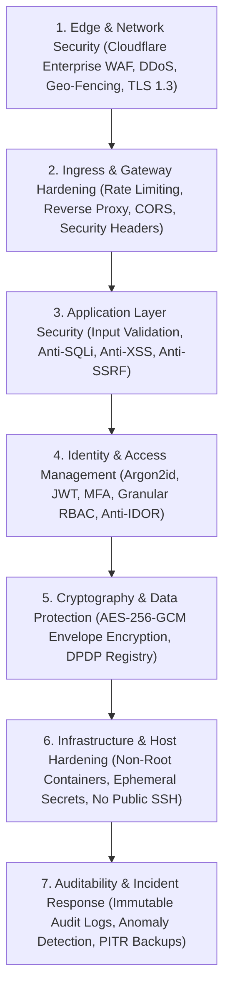
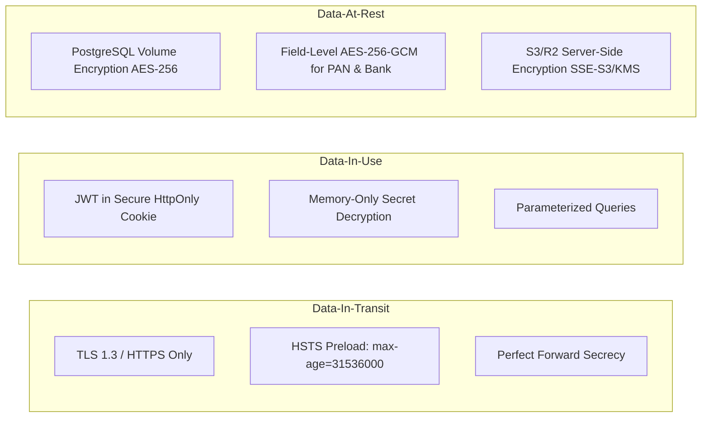
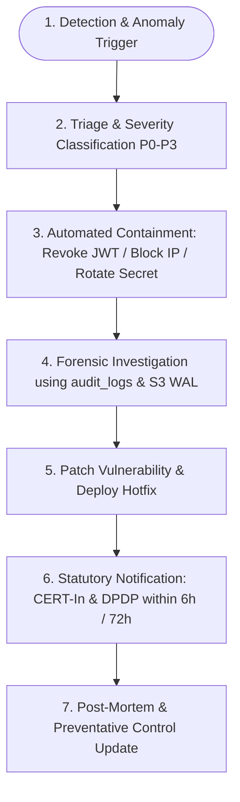

# EKhum (DanaPro / Philanthropy OS) — Software Security Model & Threat Defense Architecture

---

## 1. Executive Security Blueprint & Defense-in-Depth

As a mission-critical fintech and philanthropy platform handling millions of INR in donations, sensitive donor PII (PAN cards, phone numbers, addresses), and bank mandate credentials, **EKhum** enforces an enterprise-grade **Defense-in-Depth (DiD)** and **Zero-Trust** security architecture.

### The 7 Layers of Defense



---

## 2. Threat Modeling: STRIDE & OWASP Top 10 Defense Matrix

| Threat Category (STRIDE) | Attack Vector | Potential Impact | EKhum Defensive Control |
|---|---|---|---|
| **Spoofing Identity** | Fake donor identity / Forged webhook call | Unauthorized donation status change | Gateway HMAC-SHA256 signature verification + Webhook secret validation + Idempotency key locks |
| **Tampering with Data** | Altering donation amount or 80G certificate | Tax fraud, forged compliance receipts | Cryptographic SHA-256 hash embedded on receipts + Parameterized SQL + Immutable ledger tables |
| **Repudiation** | Admin claims they didn't export donor data | Unattributable data leakage | Append-only `audit_logs` capturing User ID, IP, User-Agent, Action, and payload diff |
| **Information Disclosure** | SQL Injection / S3 bucket exposure / IDOR | PII and PAN card leak | Parametric SQL queries, AES-256-GCM field encryption, Pre-signed private S3 URLs with 15-minute expiry |
| **Denial of Service** | DDoS on checkout page / API flooding | Platform downtime during peak appeals | Cloudflare Layer 3/4/7 DDoS shield + Redis Token Bucket rate limiting (60 req/min per IP) |
| **Elevation of Privilege** | Tenant user accessing another NGO's data | Multi-tenant data breach | Strict Parametric Tenant ID injection via JWT middleware (`WHERE organization_id = $1`) |

---

## 3. Comprehensive Protection Against Data Breaches



### 3.1 Zero-Trust Field-Level Encryption (PAN, Aadhaar, Bank Details)
1. **Envelope Encryption**: Sensitive tax IDs (`tax_id`) and bank details are never stored as plaintext in the database. They are encrypted using **AES-256-GCM** with unique initialization vectors (IV) and authentication tags.
2. **KMS / Master Key Isolation**: The encryption master key is injected via secure environment variables from AWS Secrets Manager / Vault and never logged or exposed in source code.
3. **Blind Indexing for Fast Lookups**: To support fast lookups (e.g., finding existing donors by PAN without decrypting the whole database), an HMAC-SHA256 blind index (`tax_id_bindex`) is stored alongside the ciphertext:
   $$\text{Blind Index} = \text{HMAC-SHA256}(K_{\text{blind}}, \text{Normalized PAN})$$

### 3.2 Digital Personal Data Protection (DPDP) Act 2023 Compliance
- **Verifiable Consent Registry**: The `consents` table logs explicit opt-in timestamps, exact terms text displayed, and IP address for all WhatsApp/Email communications.
- **Automated Right-to-Erasure (RTBF)**: An automated workflow pseudonymizes donor PII upon request while retaining statutory tax receipts required for 8 years under Section 80G Indian tax regulations.
- **Purpose Limitation**: Donor contact info collected for one campaign cannot be used across organizations due to strict parametric database scoping.

### 3.3 Anti-IDOR (Insecure Direct Object Reference) Protection
Every API controller strictly binds data queries to the authenticated tenant context:
```typescript
// SECURE: Enforcing organization_id from verified JWT
router.get('/api/donations/:id', authenticateToken, async (req, res) => {
  const { id } = req.params;
  const orgId = req.user.organization_id; // Extracted from verified JWT

  const result = await pool.query(
    'SELECT * FROM donations WHERE id = $1 AND organization_id = $2',
    [id, orgId]
  );
  if (result.rows.length === 0) {
    return res.status(404).json({ error: 'Donation not found' });
  }
  return res.json(result.rows[0]);
});
```

---

## 4. Comprehensive Protection Against Server & Infrastructure Breaches

### 4.1 Edge & Network Perimeter Security (Cloudflare WAF)
- **Layer 3/4/7 DDoS Mitigation**: Automatic traffic scrubbing for SYN floods, UDP amplification, and HTTP flood attacks.
- **Web Application Firewall (WAF)**: Active rulesets blocking OWASP Top 10 exploits, malicious bots, scanner probes, and known CVEs.
- **Geo-IP Restrictions**: Admin login endpoints (`/api/admin/*`) can be restricted to authorized domestic regions.

### 4.2 Multi-Tier Rate Limiting (Redis Token Bucket)

```typescript
// Rate Limiting Policy
export const rateLimiters = {
  publicCheckout: rateLimit({
    windowMs: 1 * 60 * 1000, // 1 minute
    max: 30, // 30 requests per IP per minute
    message: { error: 'Too many checkout attempts. Please wait.' }
  }),
  adminLogin: rateLimit({
    windowMs: 15 * 60 * 1000, // 15 minutes
    max: 5, // 5 failed attempts locks out IP for 15m
    message: { error: 'Too many login attempts. Account temporarily locked.' }
  }),
  apiKeys: rateLimit({
    windowMs: 1 * 60 * 1000,
    max: 120, // 120 requests/minute per tenant API Key
  })
};
```

### 4.3 HTTP Security Headers & Browser Hardening
All HTTP responses include strict defense headers enforced via `helmet`:

```http
Strict-Transport-Security: max-age=31536000; includeSubDomains; preload
X-Content-Type-Options: nosniff
X-Frame-Options: SAMEORIGIN
X-XSS-Protection: 1; mode=block
Referrer-Policy: strict-origin-when-cross-origin
Content-Security-Policy: default-src 'self'; script-src 'self' https://checkout.razorpay.com https://cdn.tailwindcss.com; frame-src https://api.razorpay.com; img-src 'self' data: https:; connect-src 'self' wss: https:;
Permissions-Policy: geolocation=(), camera=(), microphone=()
```

### 4.4 SQL Injection & Input Validation Hardening
1. **Parametric Queries Exclusively**: `pg` library parameterized queries (`$1, $2, ...`) are strictly enforced across all database calls. Dynamic string concatenation in SQL is prohibited by ESLint security rules.
2. **Schema Validation via Zod**: All incoming request bodies are validated and sanitized before reaching service controllers.

### 4.5 Server & Container Hardening (Zero Public Surface)
- **Non-Root Execution**: Docker containers run as an unprivileged `node` user (`USER node`).
- **Read-Only Root Filesystem**: Application containers execute on read-only filesystems with temporary ephemeral scratch space allocated to `/tmp`.
- **Zero Public Database Exposure**: PostgreSQL and Redis instances are deployed in private VPC subnets with no public IPv4 addresses; access is granted only via internal VPC peering.
- **No Direct SSH Access**: Server administration is performed via Cloudflare Zero Trust Tunnels or AWS Systems Manager (SSM) Session Manager with MFA.

---

## 5. Webhook Security & Anti-SSRF Defense

### 5.1 Gateway Webhook HMAC-SHA256 Verification
Incoming webhooks from Razorpay, PayU, and Meta WhatsApp are validated cryptographically before any processing occurs:

```typescript
export function verifyRazorpayWebhook(rawBody: string, signature: string, secret: string): boolean {
  const expectedSignature = crypto
    .createHmac('sha256', secret)
    .update(rawBody)
    .digest('hex');
  
  // Timing-safe comparison to prevent side-channel timing attacks
  return crypto.timingSafeEqual(
    Buffer.from(signature, 'utf8'),
    Buffer.from(expectedSignature, 'utf8')
  );
}
```

### 5.2 Outbound Webhook Anti-SSRF (Server-Side Request Forgery) Guard
When NGO administrators configure custom outbound webhooks, the dispatch engine inspects and rejects all private, loopback, and cloud-metadata IP destinations:

- `127.0.0.0/8` (Loopback)
- `10.0.0.0/8`, `172.16.0.0/12`, `192.168.0.0/16` (Private RFC 1918)
- `169.254.169.254` (AWS/Cloud Metadata Service)
- `::1` (IPv6 Loopback)

---

## 6. Real-Time Intrusion Detection & Audit Logs

### 6.1 Immutable Audit Log Engine
Every sensitive event (admin login, role update, gateway key modification, bulk 10BD CSV download, donor export) writes an immutable record to `audit_logs`:

```json
{
  "id": "a9b8c7d6-e5f4-4321-abcd-1234567890ab",
  "user_id": "7f8e9d0a-1b2c-3d4e-5f6a-7b8c9d0e1f2a",
  "user_type": "ngo_admin",
  "action": "EXCEL_DONOR_EXPORT",
  "details": {
    "filter": "FY2024-25",
    "record_count": 1420,
    "columns": ["name", "email", "amount", "tax_id_masked"]
  },
  "ip_address": "49.204.120.45",
  "created_at": "2026-09-04T17:15:30Z"
}
```

### 6.2 Anomaly & Intrusion Detection Triggers
The platform fires real-time automated security alerts (Slack/Discord/SMS) when:
1. **Bulk Export Anomaly**: More than 1,000 donor records are exported within 5 minutes.
2. **Brute Force Detection**: 5 consecutive failed logins on an admin account.
3. **Geo-Location Jump**: An active admin session switches IP geolocation across countries within 10 minutes.
4. **Gateway Failure Spike**: Gateway webhook verification failure rate exceeds 2% in a 5-minute window.

---

## 7. Disaster Recovery, Backups & Incident Response

### 7.1 Backup Strategy & RPO / RTO Targets
- **Continuous Point-In-Time Recovery (PITR)**: Write-Ahead Logs (WAL) streamed continuously to multi-region encrypted S3 storage.
- **Daily Full Encrypted Snapshots**: Stored with 30-day retention across geographically distinct cloud regions.
- **Recovery Point Objective (RPO)**: **< 5 minutes** (Maximum potential data loss window).
- **Recovery Time Objective (RTO)**: **< 30 minutes** (Full system restoration time).

### 7.2 Security Incident Response Playbook


