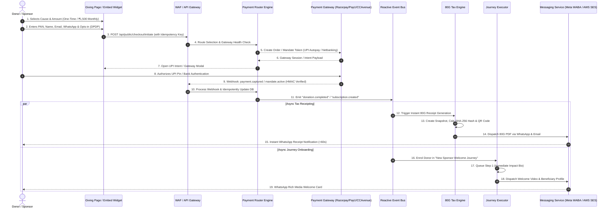
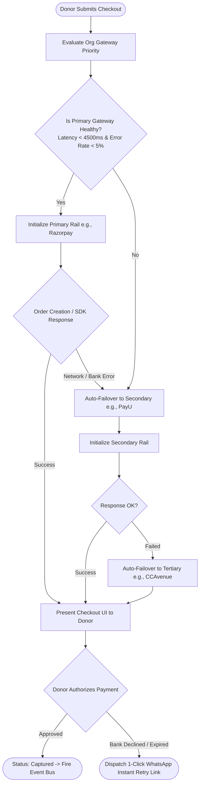
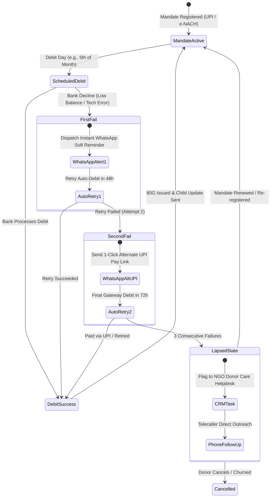
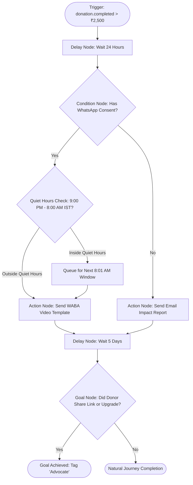
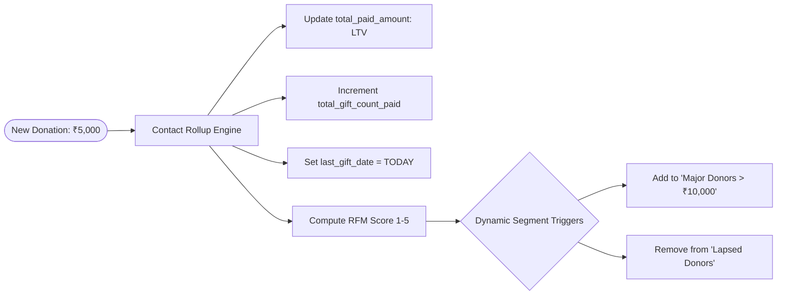

# EKhum (DanaPro / Philanthropy OS) — Working Flow & System Lifecycle Specification

---

## 1. Executive Summary & Flow Philosophy

This document defines the end-to-end execution flows, state machines, business logic lifecycles, and asynchronous event chains that drive **EKhum**.

The platform is designed around **reactive event-driven orchestration**: every donor action (page view, form focus, payment attempt, gateway webhook, tax receipt issuance, WhatsApp reply) emits an immutable event into the system's central event bus. Subscribed micro-engines (Journey Executor, Tax Engine, Messaging Router, RFM Rollup Engine) react asynchronously without blocking checkout throughput.

---

## 2. End-to-End Master Giving Lifecycle

---

## 3. Intelligent Multi-Gateway Routing & 4-Way Failover Flow

To guarantee a **Zero-Drop Checkout Guarantee**, the Payment Router evaluates live gateway health, latency metrics, and transaction outcomes across Razorpay, PayU, CCAvenue, Cashfree, and Worldline.

### Failover Decision Tree

### Gateway Health Matrix & Metrics Tracked
1. **Latency Threshold**: If gateway API p95 response time exceeds `4,500ms`, traffic is shifted to the next priority rail for 10 minutes.
2. **Error Rate Threshold**: If 3 consecutive transactions fail with `GATEWAY_DOWN` or `5xx SERVER_ERROR`, rail enters circuit-breaker `OPEN` state.
3. **Smart BIN/VPA Routing**: HDFC/ICICI bank netbanking routes to the gateway with highest direct-settlement success rates for that bank.

---

## 4. Recurring Sponsorship & Mandate Recovery Flow (Anti-Churn Engine)

Recurring child sponsorship and monthly giving pledges suffer from 25–35% annual involuntary churn due to expired cards, low UPI balances, or bank downtime on debit day. EKhum solves this with an automated 3-stage recovery cycle.

---

## 5. Visual Drag-and-Drop Journey Builder Execution Engine

The Journey Executor engine processes complex, multi-touch donor nurture sequences configured visually by NGO campaign managers.

### Node Architecture & Graph Representation

### Step Execution Algorithm
1. **Event Trigger Ingestion**: When an event occurs (e.g. `donation.completed`), the engine scans all active journeys with matching `entry_event_type`.
2. **Eligibility & Suppression Check**: The engine verifies:
   - Donor is not already active in this journey (if `re_entry_allowed = false`).
   - Donor has not opted out of communications.
   - Max concurrent journeys limit has not been exceeded.
3. **Step Scheduling**: A `journey_enrolments` record is created with `current_step_id` pointing to the first node and `next_action_due_at = NOW() + wait_duration`.
4. **Worker Execution Loop**: A high-frequency queue worker queries records where `status = 'active'` AND `next_action_due_at <= NOW()`:
   - Evaluates node conditionals (`amount > 5000`, `city = 'Mumbai'`).
   - Dispatches communication via `messagingRouter`.
   - Advances pointer to `true_branch_step_id` or `false_branch_step_id`.
   - Marks enrolment as `completed` upon reaching terminal leaf nodes.

---

## 6. Statutory Section 80G & Form 10BD Tax Engine Workflow

```mermaid
flowchart TD
    subgraph Instant Real-Time 80G Generation
        A[Payment Marked 'Captured'] --> B[Fetch NGO 80G URN, PAN, Signatory & Donor PAN]
        B --> C[Compute Cryptographic SHA-256 Digest]
        C --> D[Generate Secure Verification QR Code]
        D --> E[Render High-Resolution PDF Certificate]
        E --> F[Store in S3 Bucket: /receipts/org_id/FY2024-25/REC-001.pdf]
        F --> G[Insert eighty_g_receipts Record]
        G --> H[Deliver PDF to Donor via WhatsApp & Email]
    end

    subgraph Annual March Form 10BD Consolidation
        I([Fiscal Year End - 31st March]) --> J[NGO Admin Clicks 'Generate Form 10BD']
        J --> K[Query all eighty_g_receipts where financial_year = '2024-2025']
        K --> L{Compliance Validation Engine}
        L --> M[Valid Records: PAN / Aadhaar Present & Validated]
        L --> N[Flagged Records: Anonymous / Missing Tax ID]
        M --> O[Generate CBDT Form 10BD Standard CSV / JSON]
        N --> P[Generate Exception Audit Report for Accountant]
        O --> Q[1-Click Upload / Export for ITD e-Filing Portal]
    end
```

### Cryptographic Receipt Verification Formula
Each 80G certificate embeds a QR code pointing to `https://ekhum.org/verify/receipt/{receipt_id}?hash={sha256_hash}`.

$$\text{Receipt Hash} = \text{SHA256}(\text{OrgURN} \parallel \text{ReceiptNo} \parallel \text{DonorPAN} \parallel \text{Amount} \parallel \text{Timestamp})$$

This prevents receipt forgery, duplicate claims, or altered amounts during tax audits.

---

## 7. Dynamic RFM Segmentation & Real-Time Contact Rollup

To enable targeted marketing without manual data wrangling, every successful gift immediately updates constituent rollups:

1. **Recency ($R$)**: Days since `last_gift_date` (Score 1–5).
2. **Frequency ($F$)**: Count of `total_gift_count_paid` over lifetime (Score 1–5).
3. **Monetary ($M$)**: Total value `total_paid_amount` (Score 1–5).
4. Donors with score `5-5-5` automatically enter the **VIP Major Donor Journey**, assigning a dedicated relationship manager CRM task.
